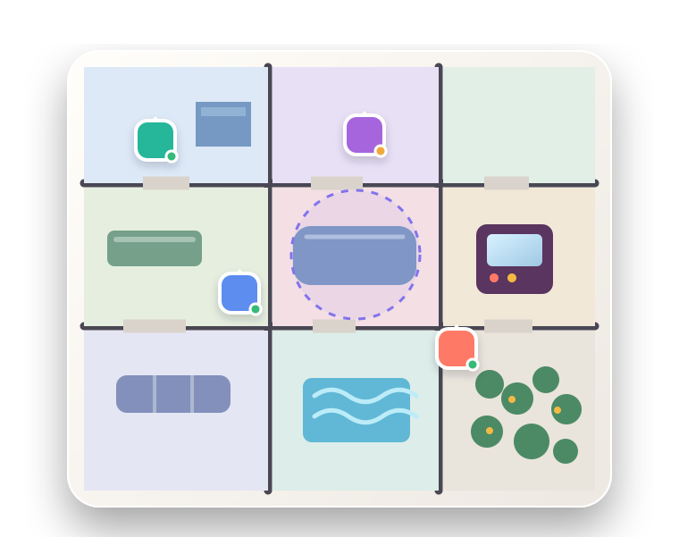

# Northstar

[](https://github.com/pureportal/work-hard-play-hard/actions/workflows/ci.yml)
[](https://github.com/pureportal/work-hard-play-hard/actions/workflows/release.yml)



Northstar is a self-hosted virtual office for distributed teams. It combines a persistent, shared workspace with realtime presence, conversations, configurable rooms, office building, and lightweight social activities. The same React client runs in the browser and in the desktop and Android applications.

## Inside the office

- See who is online, where they are, and whether they are available, busy, away, or do not want to be disturbed.
- Move between shared floors by clicking or tapping a destination, using a keyboard, or taking a portal.
- Chat in team, room, meeting, and direct conversations, with unread counts and image attachments.
- Wave, react, high-five, ring the office gong, sit together, and opt in to carrying interactions.
- Start direct-call and walk-up session flows, or use meeting views with participant state, chat, reactions, and local microphone and camera controls.
- Keep private rooms assigned to specific people and let visitors knock for access.
- Draw walls, add doors and windows, furnish rooms, change access rules, and edit the live office when you have build permission.
- Customize your avatar and, as the owner, the application name, logo, colors, login layout, registration policy, roles, and permissions.
- Play solo or multiplayer Tetris, earn coins, claim a daily reward, and use purchased items in rooms where placement is enabled.

## Use Northstar

Open the web address supplied by the person hosting your office. On the sign-in screen you can use a password, create an account when registration permits it, or choose **Server** to connect a packaged client to another Northstar installation.

The server value must be an origin such as `https://office.example.com`, without a path. Desktop installers for Windows, macOS, and Linux, plus the Android APK, are published on the [latest release](https://github.com/pureportal/work-hard-play-hard/releases/latest). Android 7.0 or newer is required. Packaged clients connect to an existing Northstar server; they do not include the server or database.

Once inside:

1. Click or tap the floor to walk there. `WASD` and the arrow keys also move your avatar.
2. Select a person or object to show the actions available at that location.
3. Use **People** to find coworkers, update access, wave, message, call, or travel to someone.
4. Use **Messages** for team, room, meeting, and direct conversations.
5. Enter an open room directly; assigned rooms can offer a knock action when their owner enables it.
6. Use number keys `1`–`6` for quick reactions.

## Self-host with Docker

You need Git and Docker with Docker Compose.

```bash
git clone https://github.com/pureportal/work-hard-play-hard.git
cd work-hard-play-hard
cp .env.example .env
```

On Windows PowerShell, copy the settings file with:

```powershell
Copy-Item .env.example .env
```

Open `.env`, replace `POSTGRES_DB_PASSWORD`, and set `NORTHSTAR_PUBLIC_URL` to the exact HTTPS origin people will use. The default `http://localhost:8080` is suitable for local use.

Start the application:

```bash
docker compose up --build --detach --wait
```

Open [http://localhost:8080](http://localhost:8080). The first account created on an empty installation becomes the owner.

New installations allow registration but require an invitation after the owner account is created. The production image does not currently provide email delivery, so invitation emails and email sign-in links are unavailable. To admit teammates, open **Settings → Registration** and either add their email domain under **Domains without invitations** or turn off **Require invitation**.

To run the optional public landing page as well, enable its Compose profile:

```bash
docker compose --profile landing up --build --detach --wait
```

It is available on [http://localhost:8081](http://localhost:8081) by default.

### Operate the deployment

```bash
docker compose ps
docker compose logs --follow server client postgres
docker compose restart
docker compose down
```

`docker compose down` leaves stored data intact. PostgreSQL data is in the `northstar-postgres` volume, while chat image uploads are in `northstar-images`; back up both. Do not run `docker compose down --volumes` unless you intend to delete the installation's data.

The server applies pending database migrations before accepting traffic. For a deployment exposed beyond the local machine, terminate HTTPS at a reverse proxy and send traffic to the client service on port `8080`; its Nginx configuration forwards both the REST API and realtime WebSocket connection to the server. Keep PostgreSQL and the server port off the public network.

### Configuration

The copied [`.env.example`](.env.example) contains the normal deployment settings.

| Variable | Purpose |
| --- | --- |
| `POSTGRES_DB_NAME` | PostgreSQL database name; defaults to `workHardPlayHard`. |
| `POSTGRES_DB_USERNAME` | PostgreSQL user; defaults to `postgres`. |
| `POSTGRES_DB_PASSWORD` | PostgreSQL password. Compose requires this value. |
| `POSTGRES_DB_HOST` | Database host used when the server runs outside Compose; defaults to `10.10.0.1`. |
| `POSTGRES_DB_PORT` | Database port used when the server runs outside Compose; defaults to `5432`. |
| `NORTHSTAR_PUBLIC_URL` | Public web-client origin used for client links and allowed browser access; defaults to `http://localhost:8080`. |
| `NORTHSTAR_PORT` | Host port for the web client; defaults to `8080`. |
| `NORTHSTAR_LANDING_PORT` | Host port for the optional landing site; defaults to `8081`. |
| `NORTHSTAR_VERSION` | Tag used for the published Northstar container images; defaults to `latest`. |
| `CLIENT_ORIGINS` | Comma-separated additional HTTP or HTTPS client origins allowed by the API. |

When running the server directly, `HOST` defaults to `127.0.0.1`, `PORT` to `3001`, and `CLIENT_URL` to `http://127.0.0.1:5173`.

## Current scope

Each Northstar server currently hosts one team and one persistent office. The included workspace has multiple connected floors, but there is no organization or office creation flow.

Call and meeting screens currently coordinate presence, participation, local device capture, and chat; remote audio/video transport is not integrated yet. Scheduled meeting examples are part of the development seed, and there is not yet a production meeting scheduler.

## Development

Local development requires:

- Node.js 24 or newer
- pnpm 10.33.2, as pinned by `packageManager`
- PostgreSQL; the deployment and CI use PostgreSQL 16
- Rust and the platform-specific [Tauri prerequisites](https://v2.tauri.app/start/prerequisites/) only for desktop or mobile builds

Install dependencies:

```bash
corepack enable
pnpm install
```

Create the `workHardPlayHard` database and export the `POSTGRES_DB_HOST`, `POSTGRES_DB_PORT`, `POSTGRES_DB_NAME`, `POSTGRES_DB_USERNAME`, and `POSTGRES_DB_PASSWORD` values for that database. Then start the API and web client together:

```bash
pnpm dev
```

The API listens on [http://127.0.0.1:3001](http://127.0.0.1:3001), and the Vite client on [http://127.0.0.1:5173](http://127.0.0.1:5173). Vite proxies `/v1`, including WebSocket upgrades, to the API. Database migrations run automatically at server startup.

Use the server package to inspect or create migrations:

```bash
pnpm --filter @workhard/server migration:check
pnpm --filter @workhard/server migration:create
pnpm --filter @workhard/server migration:up
```

Useful development commands:

| Command | Result |
| --- | --- |
| `pnpm dev:server` | Start only the Fastify server in watch mode. |
| `pnpm dev:client` | Start only the browser client. |
| `pnpm dev:landing` | Start the public landing site. |
| `pnpm dev:desktop` | Start the server and Tauri desktop client. |
| `pnpm check` | Validate release metadata, lint, type-check, test, build, and run static UI checks. |
| `pnpm e2e:auth` | Build the client and run the self-contained account and invitation browser flow. |
| `pnpm e2e` | Run the seeded workspace browser checks against the active development services. |
| `pnpm e2e:building` | Run the seeded building-system browser checks against the active development services. |

### Development seed

To populate a development database with two floors, sample coworkers, conversations, meetings, and scores:

```bash
pnpm seed
```

This command deletes all data in the configured database, including accounts and uploaded images, and is disabled when `NODE_ENV=production`. Restart the development server afterward, then sign in as `maya` with password `northstar`. All seeded accounts use that password.

### Build clients

```bash
pnpm build
pnpm build:client
pnpm build:server
pnpm build:landing
pnpm build:desktop
```

The browser build uses its current origin as the server by default. Set `VITE_SERVER_URL` in `apps/client/.env.production` when a packaged build should start with a different server. Users can still change the server from the sign-in screen. The landing build reads `VITE_CLIENT_URL` and defaults to `/app/`.

Desktop packaging builds for the current operating system and requires Rust plus that platform's Tauri system dependencies.

Android builds additionally require JDK 21, Android platform 36, build tools 36.1.0, NDK 30.0.14904198, and the Rust targets `aarch64-linux-android`, `armv7-linux-androideabi`, and `x86_64-linux-android`.

```bash
pnpm android:init
pnpm build:android
```

`android:init` generates `apps/client/src-tauri/gen/android`; the directory is intentionally ignored by Git. To create `artifacts/android/northstar-android.apk`, set the signing variables and run:

```bash
pnpm build:android:signed
```

The required variables are `ANDROID_HOME`, `ANDROID_BUILD_TOOLS_VERSION`, `ANDROID_SIGNING_STORE_FILE`, `ANDROID_SIGNING_STORE_PASSWORD`, `ANDROID_SIGNING_KEY_ALIAS`, and `ANDROID_SIGNING_KEY_PASSWORD`.

## Project structure

| Path | Responsibility |
| --- | --- |
| `apps/client` | React 19 and PixiJS client, Vite web build, and Tauri desktop/Android shell. |
| `apps/server` | Fastify REST/WebSocket server, authoritative world runtime, MikroORM migrations, and PostgreSQL persistence. |
| `apps/landing` | Small public Vite site that links to the office. |
| `packages/shared` | Shared protocol, building, geometry, assets, economy, and Tetris types and rules. |
| `scripts` | Release validation, static UI checks, browser checks, Android signing, and workspace capture tools. |
| `docs` | Building-system notes and the product/technical specification. |

The server owns movement, collision, room access, layout changes, calls, reactions, and game state. Clients exchange commands and snapshots over `/v1/realtime`; accounts, workspace state, conversations, layouts, economy, avatar images, and branding are stored in PostgreSQL. Chat image files are stored under `.data/chat-images` or the corresponding Docker volume.

See [Building system](docs/building-system.md) for the layout and room-detection model.

## Releases

Pull requests run the full workspace checks; relevant client changes also package the desktop and Android clients. Pushes to `main` publish `main` and commit-tagged Linux/AMD64 and Linux/ARM64 images for the server, web client, and landing site to GHCR.

When the workspace version changes, the release workflow also publishes versioned container images and creates a GitHub release containing Windows, macOS, and Linux desktop packages, a signed universal Android APK, and SHA-256 checksums. Versions in the root packages, workspace packages, Tauri configuration, Cargo manifest, and Cargo lockfile must match.

Release maintainers configure `ANDROID_KEYSTORE_BASE64`, `ANDROID_KEYSTORE_PASSWORD`, `ANDROID_KEY_ALIAS`, and `ANDROID_KEY_PASSWORD` as GitHub Actions secrets. `NORTHSTAR_SERVER_URL` is an optional Actions variable that sets the packaged clients' initial server.

## Help

If Northstar is not starting, check `docker compose ps` and the relevant lines from `docker compose logs`. When opening a [GitHub issue](https://github.com/pureportal/work-hard-play-hard/issues), include those details, the client platform, and the Northstar version, but remove passwords, cookies, invitation links, and other secrets.
