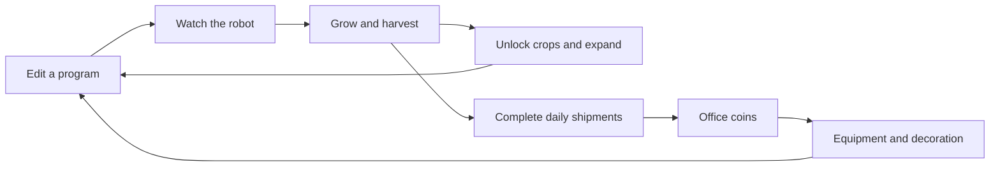
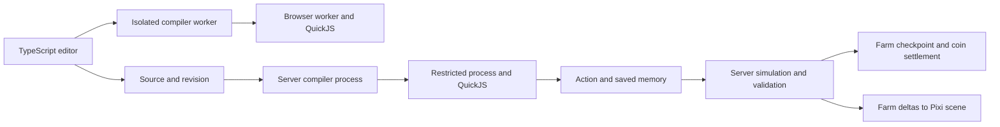

Automation farm implementation plan — September 18, 2026

**Build a small programmable farm inside the existing game, with TypeScript as the player scripting language.** Open the laptop, tend a plot, write a routine, watch a little robot execute it, and use the harvest to expand the farm. The pleasure should come from making something work, noticing an inefficiency, and improving it. A free-build sandbox should be available from the beginning.

The main reference is [The Farmer Was Replaced](https://store.steampowered.com/app/2060160/The_Farmer_Was_Replaced/): visible farming automation, a small Python-like language, and resources that unlock new capabilities. [Bitburner](https://store.steampowered.com/app/1812820/Bitburner/) supplies the secondary inspiration of scripting as a long-term progression system. The mechanics below are our design proposal, with original characters, crops, artwork, and challenges.

This document proposes implementation; it changes no gameplay, assets, prices, or reward rules. All new prices, capacities, timings, performance budgets, and estimates below are starting targets for prototypes and playtests. The recommended stack is TypeScript compilation, QuickJS in WebAssembly for guest execution, CodeMirror for editing, and the existing React/PixiJS/Blockbench pipeline for presentation.

**Start with a complete, small game loop.** Give each player one persistent personal farm, accessible through an owned laptop in Inventory or through its placed counterpart. Additional laptops open the same farm. Access should not depend on finding space for a new building.

1. Start with a free 4 × 4 plot, one expressive robot, one crop, and basic manual controls.
2. Plant, water, and harvest once to see the rules. Target the first harvest within two minutes and a working script within ten minutes, with an example players can edit immediately.
3. Automate the repetitive actions. Connect the returned action in the code with the matching robot animation.
4. Spend harvested resources on crop research and farm expansion. Different crops introduce timing, routing, and resource-allocation problems.
5. Exchange some produce through daily shipments for ordinary office coins. Spend those coins on useful equipment and things worth displaying.
6. Return to improve throughput, try a different layout, or experiment freely in Sandbox.

The free kit must support a self-sustaining loop. Basic seeds and water cannot create a coin debt or a permanent failure state. Mature crops wait for collection; absence does not destroy the farm. Mistakes should be readable and occasionally funny: a blocked robot gives a puzzled head tilt, or an unnecessary watering action produces one small splash. Create the starter farm on the player's first farm action; new installations contain no demo farms or shared demo accounts.



**Keep the farm spatial and visible.** Use a dedicated Pixi farm scene beside the editor. The scene has its own small grid, camera, and bot movement rules. Robots stay inside it; they do not become workplace players or use workplace pathfinding. This keeps routing understandable and avoids adding frequent bot searches to the existing movement runtime.

A new placeable greenhouse terminal can later show a small animated farm preview in the office and open the same scene. Its placement, rotation, ownership, and resale use the existing building system. Moving or storing the terminal changes the display, not farm identity or progress. Existing decorative garden beds and food remain decorative; functional farm equipment receives distinct catalogue entries.

**Give progression and Sandbox different purposes.** Both use the same simulation and TypeScript execution package, with different configuration and persistence boundaries. Sandbox is the creative game mode; code isolation applies in both modes.

| Mode | What the player can do | What persists or earns |
| --- | --- | --- |
| Farm | Grow resources, research crops, expand, purchase equipment, and fulfill shipments at normal speed | Server-owned farm progress and eligible coin transactions |
| Sandbox | Use all released parts, free resources, editable layouts and crop states, fixed seeds, reset, step, and accelerated time | Separate sandbox saves and programs; no wallet, research, or reward changes |

Keep a visible mode selection beside the run controls. Sandbox reset affects only that sandbox. Allow copying source code and layout blueprints between modes, but validate dimensions, owned equipment, and costs when applying a blueprint to the farm. Never copy inventories, elapsed time, unlocks, or completion receipts. Imported source opens paused.

Production commands derive ownership and mode from the server's farm record. A client-supplied mode flag cannot make Sandbox output eligible for rewards.

Target a launch ceiling of 16 × 16 cells and four robots in either mode. The starter farm remains 4 × 4 with one robot. Sandbox acceleration can begin at 1×, 4×, and 16×, bounded by its worker budget; it never changes production time. This is a creative sandbox with practical size limits.

**Make each unlock introduce a new problem.** The proposed launch progression is deliberately narrower than a factory game.

| Stage | Content | New decision |
| --- | --- | --- |
| First session | 4 × 4 plot, robot, root vegetable | Planting, conditions, watering, harvesting, and waiting |
| Early farm | 8 × 8 expansion and byte berries | Plan a route around a crop that regrows after harvest |
| Intermediate farm | Mushrooms, irrigation, and composting | Allocate water and compost; group crops around useful equipment |
| Established farm | Up to 16 × 16 and four robots | Split work, avoid collisions, and coordinate supply |
| Continuing play | Seeded efficiency challenges, new layouts, display rewards | Solve a different constraint instead of only raising a number |

Roots can favor simple replanting, berries repeated visits, and mushrooms shaded adjacency. Prototype those differences before making all their artwork. Start with one harvested-resource inventory and research costs expressed in actual crops; do not introduce several interchangeable currencies.

Loops, conditions, variables, and functions should be available as language features. Introduce them gradually through examples and farm goals. Equipment unlocks useful actions and new problems, rather than charging players to write a loop.

For multiple robots, each gets a program and its own saved memory. Start with assigned working areas and a read-only view of other robot positions; shared mutable script memory is outside launch scope. Resolve same-tick tile reservations in a stable rotating order; blocked movement consumes time and supplies a failure result to the next decision. Disallow head-on swaps and moving into cells occupied at the start of that tick; rotate priority when robots contest an empty cell. Robots can walk over crop cells, but cannot leave the grid or enter equipment cells. Avoid nondeterministic thread behavior as a gameplay mechanic.

**Use real TypeScript with a small typed farm API.** Players get normal variables, functions, loops, arrays, objects, interfaces, unions, and generics within the runtime's resource limits. Use the official TypeScript compiler to emit JavaScript; do not build a separate language grammar. Start with one `main.ts` per robot and one built-in module, `@farm/api`. Package installation, project configuration, external imports, and arbitrary browser/Node APIs are outside the scripting environment.

Recommend a synchronous `step(farm): Action` entry point for launch. The scheduler calls it when that robot is ready, executes its returned action, and calls it again after completion. This keeps the familiar sense-program-watch loop while making every decision resumable. A first program automates one tile:

```typescript
import type { Action, Farm } from "@farm/api";

export function step(farm: Farm): Action {
  const tile = farm.here();

  if (tile.crop === null) return farm.plant("root");
  if (tile.ready) return farm.harvest();
  if (tile.water < 30) return farm.water();

  return farm.wait(10);
}
```

Water is an integer percentage. Waiting takes simulation ticks, initially ten per second. `farm.plant`, `farm.move`, and other action methods construct requests; only the single returned action is executed. A loop can inspect tiles and calculate a route, then save its next waypoint in `farm.memory`. Calling movement repeatedly without returning an action does not move the robot. Teach this through the editable starter example and action stepping.

| API surface | Initial contract |
| --- | --- |
| `here()`, `tile(x, y)`, `position`, `size`, `inventory` | Read-only, bounded snapshot of this farm; out-of-bounds tile queries return `null` |
| `plant(crop)`, `water()`, `harvest()` | Request work on the robot's current cell |
| `move(direction)` | Request one cardinal movement; no hidden world pathfinding |
| `wait(ticks)` | Request a bounded positive integer delay |
| `lastResult` | Result of the previous action, including blocked movement or missing resources |
| `memory` | Per-robot JSON data persisted between decisions; typed as `Farm<Memory>` for advanced programs |
| `tick`, `random()`, `log(value)` | Simulation time, seeded randomness, and bounded plain-text debug output |

Each invocation gets a fresh guest runtime, the farm snapshot, and the last committed memory. Module globals and local variables last for one invocation; only explicit memory survives. Accept one validated action and the updated memory together. A thrown error, timeout, invalid action shape, or invalid memory discards the decision. A valid action that later fails, such as moving into a contested cell, still consumes its interval and records `lastResult`. Type assertions and `any` never bypass runtime validation.

This contract avoids persisting JavaScript stacks, closures, promises, or VM heaps. A long-lived `async main()` with `while (true)` and awaited robot actions would require a different continuation/recovery design. Do not promise transparent checkpointing of such programs or maintain two execution styles. Validate the `step` experience in the first playable; if it is not enjoyable, settle the execution contract before building progression. Standard TypeScript remains the language; the game API requires a synchronous result and does not schedule guest timers or asynchronous jobs. Reject top-level await and asynchronous entry points, and validate the result even if the program bypasses type checking.

Manual controls issue the same domain commands, with the same costs and timing. Taking manual control pauses that robot at an action boundary. `Pause` finishes the pending action and stops requesting decisions. `Step` runs one decision and completes its action; it is action stepping, not a JavaScript line debugger. Production time still advances at normal speed. Editing changes a draft; applying a valid revision takes effect at the next action boundary. Keep the previous revision running until replacement succeeds, and reset saved program memory when applying changed source.

**Make the editor useful without loading an IDE at startup.** Recommend lazy-loaded CodeMirror 6 with TypeScript syntax, indentation, completion, hover types, inline diagnostics, and editable examples. Its [TypeScript syntax example](https://codemirror.net/examples/basic/) and [completion extension](https://codemirror.net/examples/autocompletion/) are useful building blocks; semantic TypeScript completion requires our own language-service integration. Run the TypeScript language service in a dedicated browser worker, separate from farm execution so a stuck program cannot block editing or Stop.

Use a fixed virtual project containing the player's source, vetted standard-library declarations, and the generated farm declarations. Set `strict`, `noEmitOnError`, an agreed JavaScript target, `types: []`, and no DOM/Node declarations. Resolve only the built-in API; reject package/path/URL imports, dynamic imports, and triple-slash references to outside files. The server repeats compilation using the same pinned compiler and options. TypeScript's [compiler API](https://github.com/microsoft/TypeScript/wiki/Using-the-Compiler-API) supports programs, diagnostics, and emission; `transpileModule` alone is insufficient for semantic type checking. The compiler is an authoring tool, not a security boundary.

TypeScript compilation must happen on source changes, not every simulation tick. Cache successful JavaScript output by source hash, compiler version, API version, and options. QuickJS still parses and evaluates that output in each fresh runtime; measure this cost. Generate the editor declarations and runtime command schemas from one maintained API contract, and check their agreement in CI. Map runtime errors to the original TypeScript using emitted source maps. Tag the exported function's returned action with its source span for highlighting; this debug metadata grants no authority. Test source mapping through helper functions and compiler transforms in milestone 0.

On wide screens, place farm and code side by side. On narrow screens, use Farm and Code tabs with persistent run controls. Show selected tile details, errors, and logs when relevant. Provide keyboard tile selection, accessible action controls and state text, touch controls, and reduced motion. Crop state must be readable from shape as well as color. Keep API reference material in a drawer; do not fill the main scene with permanent explanations.

**Execute guest JavaScript inside QuickJS compiled to WebAssembly.** Recommend the standard synchronous `quickjs-emscripten` build. It supports browser and Node execution and exposes memory, stack, and interrupt controls. Use a pinned, reviewed build and test its actual packaged engine, rather than assuming every feature of upstream QuickJS is present. [QuickJS bindings documentation](https://github.com/justjake/quickjs-emscripten).



Treat the player, their source, imports, return values, logs, client, and network messages as untrusted. Protect the host process, other accounts, workplace responsiveness, and wallet integrity through these boundaries:

- **Guest boundary:** copy bounded input data into QuickJS and copy a validated result out. Implement queries and action constructors inside the guest SDK. Do not pass host objects, callbacks, credentials, or application services into player code. Do not install QuickJS `std`/`os` modules or a general module loader. No DOM, fetch, sockets, filesystem, process environment, or Tauri bridge is exposed.
- **Execution boundary:** browser execution lives inside a terminable Web Worker; server compilation and execution use separate bounded pools of restricted child processes. Processes receive no application secrets or database handles and have OS-enforced network/filesystem restrictions and memory/CPU quotas. A child process alone is not a permission boundary. Specify and test the deployment's restrictions before enabling real rewards.
- **Authority boundary:** only the server advances production state and spends inventory. Upload source; reject client-supplied bytecode, harvests, elapsed time, payouts, and private farm IDs belonging to another user. The runner requests actions; it cannot write a wallet. Sandbox outputs never enter production settlement.

For the initial production deployment, package compiler and runner pools in restricted Linux containers with no network, no host mounts or secrets, read-only filesystems, bounded temporary storage, non-root users, dropped capabilities, and CPU/memory/process limits. Configure these explicitly using the [container execution controls](https://docs.docker.com/engine/containers/run/) and [resource limits](https://docs.docker.com/engine/containers/resource_constraints/). A supervisor outside the guest containers manages the pool through bounded pipes; runners never receive a container-management socket. Exercise this deployment from the Windows development environment through the same container setup. Bundle browser workers and Wasm locally for web and Tauri, with narrowly scoped CSP permissions verified in the spike.

Never execute player JavaScript through host `eval`, host `Function`, an injected script tag, or `node:vm`. Node explicitly warns that [`node:vm` is not a security mechanism](https://nodejs.org/api/vm.html). A Worker protects responsiveness but still has host capabilities: [Workers can use network APIs](https://developer.mozilla.org/en-US/docs/Web/API/Web_Workers_API/Using_web_workers). QuickJS isolation and process policy must remain effective even when code circumvents authoring-time restrictions.

| Initial limit | Proposed starting value |
| --- | ---: |
| Source | 32 KiB per robot; one source file plus the built-in SDK |
| Compiler process | 512 MiB total memory and 2-second job watchdog |
| Compile submissions | 2 per second per account, burst 5; queue and cache bounded globally |
| QuickJS runtime | 16 MiB guest allocation limit and 512 KiB stack limit per decision |
| Decision work | 1,000 engine interrupt callbacks, calibrated in the spike; this is not an exact instruction count |
| Runner watchdog | 250 ms per bounded job, enforced by the parent process |
| Runner process | 256 MiB total memory, including Wasm memory and host allocations |
| Saved memory | 16 KiB per robot, nesting depth 16, finite JSON values only |
| Output | One action; bounded memory and logs; 64 KiB maximum result envelope |
| Debug output | 200 retained lines, 20 new lines per second, 512 bytes per line |

Source and guest limits apply in both environments. OS process limits apply on the server; browser Workers use termination deadlines and tested project-size caps, with no promised per-Worker host heap limit. If the required isolation cannot be established, keep production execution disabled and retain editable source.

Apply guest budgets to module initialization, the decision, and result serialization. Protect getters, proxies, `toJSON`, recursion, regular expressions, microtask creation, and huge allocations as well as explicit loops. Never pump an unbounded guest promise queue. Validate sizes before copying into the host; serialize within the guest budget, parse into plain data, reject dangerous property keys, and never merge guest data into host configuration. Explicitly dispose every QuickJS handle/runtime and verify cleanup after success, error, and cancellation.

Cap compiler input before parsing; parser and type-checker resource abuse must be killable by their process watchdog, including recursive types in very small source files. Bound emitted JavaScript, maps, diagnostics, and caches as well. Guest heap limits do not cap total Wasm/process memory; enforce both. Use finite queues and per-account fair scheduling with a global catch-up budget. Load the Wasm module once per pool process, but create/dispose guest runtimes for each decision; no persistent guest object may leak between decisions or accounts.

Stop cancels the run generation and drops late worker results. Watchdog termination abandons the uncommitted job, replaces its process, and allows a bounded retry from the committed checkpoint. Deduplicate every accepted action by farm, run generation, robot, and sequence; stale or repeated results cannot apply twice. Record infrastructure timeouts separately from deterministic script-budget errors, and back off repeated failures. Fuzzing and an independent review of the exposed boundary are release requirements; choosing QuickJS does not establish the security of our integration.

**Make the simulation deterministic and independent of rendering.** Use integer simulation ticks, stable entity IDs and iteration order, seeded randomness, and explicit action durations. The same state, source, seed, and commands must produce the same result in a browser worker and on the server when within execution limits. Pin the compiler, QuickJS artifact, SDK, and simulation content versions for a run. Remove wall-clock/time-zone/locale sources from the guest; replace guest `Math.random` with the same deterministic source as `farm.random`, and expose time through `farm.tick`. Seed script randomness from the public farm seed, robot ID, and decision sequence. Keep simulation randomness server-owned; player output cannot replace the seed or crop rolls. Rendering interpolates between states without changing them.

Start with 10 simulation ticks per second. Robot movement can begin around two cells per second and increase through equipment; it remains independent of display frame rate. Crop growth uses scheduled due ticks. Request decisions only when a robot becomes ready, not every tick or rendered frame. Work advances at the next action or crop event where possible instead of scanning every crop every frame. Run bounded simulation batches outside the main server event loop, and schedule observed and unattended work fairly.

Stop drawing hidden farm scenes and skip offscreen decorative animation while retaining simulation state. Resume an animation from its action ID and start tick. Do not replay a screen full of old harvest effects after reconnecting.

**Save the farm independently from its furniture.** Keep a stable farm ID under the player's account in the current server/workspace. The state belongs to that farm; the laptop is an access point. Equipment receipts can refer to stable owned-item IDs, while placements refer to that equipment. Storage, removal, sale, donation, account removal, and workspace restore all need explicit lifecycle handling.

Before removing active equipment, finish the current action and pause dependent programs. Return supported contents to farm storage, or reject removal with the specific capacity problem. Selling equipment never resets unlock history, daily allowance, or settlement receipts. A free starter kit has zero resale value and cannot be repeatedly reclaimed for money.

| Proposed record | Minimum responsibility |
| --- | --- |
| Farm | Owner, revision, grid, resource inventory, research, equipment, seed, last processed time |
| Program | Farm/robot association, source, revision, compile diagnostics |
| Run checkpoint | Source/API/engine/content revisions, run generation, robot state, explicit program memory, last action result, pending action and sequence, simulation tick, server random state, unattended cutoff |
| Production usage | Owner and UTC day with consumed coin allowance |
| Shipment receipt | Unique completion ID, consumed inputs, reward amount, daily usage, and coin transaction reference |

Use bounded JSON state where appropriate; a database row per crop or per animation frame is unnecessary. Save program/layout changes immediately, checkpoint active runs periodically, and save before financial settlement. A process crash may replay the bounded interval since the last checkpoint deterministically; acknowledged purchases and rewards must already be durable.

The existing [economy store](../apps/server/src/economy/economy-store.ts) keeps balances and replay indexes in memory, while [workspace persistence](../apps/server/src/persistence/postgresql-workspace-repository.ts) synchronizes a workspace snapshot. Coordinate integration through the existing persistence owner. Do not add an independent SQL wallet writer that a later workspace snapshot could overwrite.

For a shipment, stage the resource deduction, usage update, receipt, ledger entry, and wallet update; commit them in one database transaction through that coordinator; then publish success and the new in-memory revision. Serialize other wallet mutations and snapshot capture across that commit; invalidate queued snapshots from an older revision. On a known rollback, keep the previously committed state and permit an idempotent retry. If the commit outcome is unknown, reload the receipt and committed state before allowing further wallet writes. Extend the current transaction kinds, database constraints, and restore validation together. Farms get focused checkpoint writes so ordinary bot actions do not trigger full workspace saves.

Use a unique farm per owner, unique `(owner, UTC day)` production usage, and unique `(owner, shipment ID)` settlement receipts. Retried commands carry stable idempotency keys. Recheck the farm revision, inventory, shipment offer, and remaining allowance in the committing transaction. A farm purchase that spends both coins and produce uses this same transaction path.

Run one scheduler owner for the existing server process. If production later uses multiple application instances, farm leases and durable fencing are a prerequisite to enabling more than one scheduler. The first release need not introduce distributed execution.

**Support bounded offline progress after online correctness is proven.** Use the same TypeScript decision runner and action simulation for unattended work. Closing a panel, closing the application, reconnecting, and restarting the server all reconcile from the last committed cursor. An open tab is not required. The saved state contains explicit memory and pending actions, so recovery never needs to reconstruct a JavaScript call stack.

- Start with a four-hour unattended horizon, further bounded by storage, available inputs, and stopped or faulty programs. Evaluate a 24-hour horizon only after measuring the four-hour case.
- Reconcile in small queued worker jobs with persisted cursors and a fixed cutoff. Deduplicate jobs per farm and prevent overlapping online and catch-up work.
- Skip empty waiting intervals to the next event. Do not estimate arbitrary programs using a remembered average production rate or assume an entire day's script can execute in one request.
- Apply per-job, per-account, and global CPU quotas. Yield catch-up batches after a target 10 ms of work; the process watchdog is a separate hard limit. Preserve the cursor between chunks; never replay the full elapsed interval on every reconnect. Freeze the cutoff for that reconciliation so the queue does not chase a moving backlog indefinitely.
- Complete reconciliation before accepting a new production run or spending its output. Keep the editor usable as a draft while a farm is catching up.
- At the unattended horizon or full storage, stop unattended work and discard time beyond that cutoff. Restarting or reopening cannot recover those hours.

At two actions per second, four robots could request 115,200 decisions in four hours, or 691,200 in a day. Even 0.1 ms per complete decision would mean about 11.5 or 69 seconds of CPU per farm before other work. These are illustrative calculations, not benchmarks. Event skipping helps waiting and growth, but cannot skip arbitrary player decisions. Gate the unattended horizon on measured recovery latency and aggregate cost; a timeout must not grant estimated output or erase already committed progress.

Persist simulation, compiler, SDK, engine, and source revisions with the checkpoint. A deployment that changes execution semantics pauses affected runs and asks the player to run the retained source again. Preserve farm progress and source; validate saved memory against the active contract or clear that program's memory when it is reapplied. Do not run old elapsed time under new crop rules. No parallel legacy runtime or bytecode compatibility path is planned.

For the first release, offline farming accumulates bounded produce, not unclaimed coin entitlements. Shipments consume produce and use the current server UTC day's allowance when committed. There is no backlog of missed daily coin orders to cash out. This gives one understandable settlement rule for manual, scripted, online, and offline harvests.

**Preserve a reason to keep playing after today's coins are earned.** Harvested resources fund crop research, recipes, and plot expansion; office coins purchase equipment and decoration. Farm resources have no direct unlimited conversion into wallet coins and cannot be sold as catalogue items.

The current [economy rules](../packages/shared/src/economy.ts) provide 250 welcome coins, daily bonuses of 10/15/20/25/30/35/50, and a shared 100-coin daily game cap. Keep those values. Test a separate production allowance of up to 25 coins per player per UTC day, shared by every farm and any future automated business. Manual farming uses that same production allowance. A farm reset, extra terminal, extra robot, or Sandbox session cannot create a second allowance.

This would raise the sustained mature maximum from 150 to 175 coins per day, about 16.7%, before spending. It is a proposed balance change. Do not route harvests through fake Falling Blocks scores. Shipment completion requires its own server evidence and receipt. Challenge rewards, if added later, use the existing active-game allowance and cannot also pay as shipments.

Size shipment offers to the remaining allowance and show their produce cost and coin payment before confirmation. Recheck both during settlement. Never consume a full-price shipment for a reduced or zero payment without presenting the changed offer. After the allowance is used, growing, research, and optimization remain available.

| Proposed spending | Starting price band | Purpose |
| --- | ---: | --- |
| Robot shells, planters, terminal accessories | 75–300 coins | Personal expression and small repeat goals |
| Irrigation or compost equipment | 300–600 coins plus farm resources | Different layouts and fewer routine actions |
| Extra robot capacity or larger equipment | 800–1,200 coins plus research | Coordination and more complex programs |
| Greenhouse displays and themed decoration sets | 1,200–2,500 coins | Longer savings goals visible in the office |

Basic farming should not require mandatory maintenance fees or paid seeds. Retain resale at one-third of recorded purchase cost, rounded down; free grants have zero recorded cost. An upgrade that costs 500 coins takes at least 20 days to repay at an additional 25 coins every day, and adds no coin income if the farm already reaches the allowance. Sell it on what it enables, not a promise of higher daily income.

At the proposed mature ceiling, a 1,200-coin item still requires seven full earning days from zero; casual play takes longer. That alone does not guarantee months of engaging progression. Measure first-script time, days to equipment purchases, repeat experiments, spending versus income, and whether different crops actually require different programs. Balance substantial goals over weeks and leave open-ended optimization available immediately in Sandbox. Exact completion duration needs playtesting.

**Create original Blockbench assets with gameplay-readable animation.** Follow the established cel-shaded anime style, orthographic projection, material families, and four cardinal directions. Keep the robot appealing and expressive at normal game zoom. Use geometry, silhouettes, and poses for state changes; avoid relying on tiny text or elaborate particle effects.

The current [native model workflow](../scripts/world-assets/blockbench/README.md) already provides editable models, calibrated renders, packed atlases, and visual checks. Persistent geometry and animation edits belong in source modules, with `.bbmodel` exports retained. Reuse its renderer and importer rather than introducing a second art toolchain or a runtime 3D engine. [Blockbench's animation tools](https://blockbench.net/) support rigging and position/rotation/scale keyframes; author actual articulated motion before sampling it into sprites.

| Asset family | Launch artwork and motion |
| --- | --- |
| Modular farm bed and soil | Edge/corner pieces; empty, planted, dry, and watered states |
| Farm robot | Idle, move, plant, water, harvest, blocked; separate tool rig and consistent ground anchor |
| Three crops | Seedling, growing, mature, and harvested/regrowing shapes; shared small harvest effect |
| Robot dock | Idle and servicing motion |
| Irrigation unit | Idle and watering action |
| Composter | Idle and processing action; clear input/output geometry |
| Shipping crate | Empty/filled state and short shipment response |
| Greenhouse terminal | Readable office object and small activity loop |

Produce the robot, bed, and one crop first. Begin with one approved material design; add catalogue variants once silhouettes, scale, and animation work. For short actions, test roughly 6–10 frames at 10–12 frames per second; use fewer frames for a slow idle. Animation sampling and simulation timing remain independent.

The existing [artwork type](../apps/client/src/world-asset-artwork.ts) and [texture playback](../apps/client/src/world-asset-textures.ts) describe a single loop. They do not yet describe named actions, one-shot completion, or crop stages. Extend the canonical export/manifest/playback contract to named clips, loop flags, explicit durations, direction, bounds, and anchors. Regenerate and validate existing assets against the resulting format; do not retain a second manifest reader for the old format.

Keep source/runtime metadata for farm-only sprites separate from shop listings, while sharing model rendering, atlas packing, and texture loading. Individual crops and robot animation poses should not become office catalogue products.

Use union bounds across poses to prevent jitter, with the same ground anchor across transitions. Tie harvest and water effects to simulation action events; reaching a particular animation frame must never award an item. Use a shared atlas for repeated plants. Prefer compact pages up to 2,048 pixels, with 4,096 as the maximum for new animated pages, and split clips when necessary. Measure decoded bytes and mipmaps, not just compressed downloads.

The delivery pipeline is model source → editable `.bbmodel` → named clips sampled in four directions → packed PNG source atlases → optimized WebP delivery copies and manifest → shared Pixi textures. Keep frame IDs stable within each generated manifest and publish it with the matching content-hashed images. One 2,048 × 2,048 RGBA atlas is 16 MiB before mipmaps, approximately 21.3 MiB with a full mip chain; atlas count matters more than the download size. Load only the active material and required clips, not every unlock and cosmetic variant.

Review every released direction, clip, and material at actual gameplay size. Check native model round trips, moving joints, loop closure, action-to-idle transitions, clipping, crop readability, footprints, shadows, transparency, depth ordering, and reduced motion. Review the greenhouse beside existing furniture and avatars before approving its scale.

**Fit the feature into the current architecture.** The project already uses React for UI, PixiJS for its world, a Fastify/Node authoritative runtime, and MikroORM/PostgreSQL for persistence. The current source supports those integration points; none of the farm modules below exist yet.

| Proposed location | Responsibility |
| --- | --- |
| `packages/shared/src/automation/` | Lightweight farm data, command schemas, content definitions, and protocol types |
| `packages/automation/` | Shared pure simulation, guest SDK, TypeScript compiler adapter, and QuickJS runner through separate entry points; depends on the lightweight shared contracts |
| `apps/server/src/automation/` | Commands, ownership checks, scheduler, isolated job broker, farm lifecycle, offline reconciliation, and shipment settlement coordination |
| `apps/server/src/persistence/` | Farm entities/repository and additive schema migrations; integration with the existing transaction owner |
| `apps/client/src/automation/` | Lazy-loaded panel, editor, local worker, farm scene, inspector, and event interpolation |
| `scripts/world-assets/blockbench/automation/` | Farm-specific model and animation source modules within the existing generation pipeline |
| Existing asset/protocol/economy modules | Focused registrations and shared contract changes; no farm implementation inside the large world canvas or world runtime |

Prefer focused files for compilation, execution, simulation, rendering, and settlement. Keep compiler and Wasm imports out of the existing shared root barrel and initial client bundle. The new package has actual client/server reuse; it is not a general plugin framework. Add pinned TypeScript runtime/compiler dependencies, the chosen synchronous QuickJS artifact, and CodeMirror packages only in the implementation milestone, with license notices and a dependency update policy. Coffee automation, a server farm, or a bot arena can reuse the proven scheduling later.

Send farm updates only to its owner while subscribed. Send a compact display summary to relevant workplace viewers if a greenhouse is placed. Keep source, logs, private inventory, and full tile state out of floor-wide snapshots. Start with revisioned deltas at up to 5 Hz while observed, a full snapshot on subscription or revision mismatch, and no animation-frame traffic. Use the existing backpressure behavior. A slow client receives a fresh state rather than an unbounded event backlog.

**Make performance a release gate.** Retain the existing renderer and loading structure. The recent [performance investigation](performance-investigation-2026-09-17.md) identifies texture residency, synchronous movement work, and broad persistence as areas to avoid amplifying; its historical measurements are not a benchmark of the proposed farm.

Batch crop sprites, pool short-lived effects, update only changed tiles, share frame textures, and release farm-only resources after the panel closes and the warm-cache period ends. Precompute selection masks or use farm grid hit testing instead of reading an entire animation atlas on first click. Profile coarse viewport culling before committing to it; [PixiJS notes that culling can add cost in CPU-bound scenes and recommends spritesheets for batching](https://pixijs.com/8.x/guides/concepts/performance-tips).

| Proposed acceptance target | How to measure |
| --- | --- |
| Desktop: 60 fps target; p95 frame interval ≤20 ms, p99 ≤33 ms | Ten-minute production-build runs on a recorded reference device; 16 × 16 farm, four bots, all crop types, editor open |
| Lower-powered/native target: stable 30 fps; p95 ≤33 ms | Physical Android/WebView and a recorded integrated-GPU device, with optional visual effects reduced |
| Pause/step feedback <100 ms locally | Input-to-visible-feedback; measure action completion and server acknowledgment separately under 80/160 ms RTT |
| Decision p95 <2 ms; domain simulation p95 <1 ms per 100 ms slice per maximal farm | Include runtime creation, guest initialization, execution, serialization, and disposal; record pure simulation separately, plus queue delay and aggregate CPU |
| Type diagnostics p95 <300 ms warm; editor ready <2 seconds cold on the reference desktop | Production bundle and worker startup; first Wasm compile, repeated source edits, type-heavy abuse cases, and native packaging |
| No material workplace regression | Paired runs with and without farms: world tick p99 <50 ms and no more than 10% regression in movement response or steady frame time |
| Starter farm artwork ≤5 MiB transferred; full visible farm texture budget ≤64 MiB RGBA including estimated mipmaps | Production network capture, atlas inventory, and texture accounting; record decoded-image and process memory separately |
| Closed feature adds ≤10 KiB gzip to the initial JS dependency graph | Bundle comparison; editor, TypeScript services, QuickJS Wasm, and farm metadata remain lazy |
| Observed farm averages ≤10 KiB/s of application payload | Representative activity; measure snapshots, bursts, reconnects, and transport overhead separately |
| No memory growth across 20 open/close and floor-change cycles | Texture references, worker lifetime, retained listeners, JS heap, and process-memory trend after cleanup |

Use normal and stress fixtures: starter farm; maximum launch farm; four identical versus distinct bot designs; invalid and tight-loop scripts; 20 and 100 concurrently active server farms; mass offline return; and an experimental 32 × 32/eight-bot scene beyond the launch limit. A 100-farm test is a load probe, not a promised deployment capacity. Establish the supported concurrency from measurements and leave headroom.

Keep React out of the animation loop: update panels from coarse snapshots and operate sprites imperatively. Bound the number of compiler/runner processes instead of holding a runtime per farm. Pause rendering when hidden, terminate local Sandbox execution on close after saving its state, and measure TypeScript-worker and Wasm residency separately from GPU textures. Do not log player source into operational telemetry; record timings, error categories, queue depth, and content versions.

Keep workplace movement, meetings, chat, arcade games, build previews, and floor changes in mixed-load runs. Record p50/p95/p99, long tasks, worker queue delay, event-loop delay, transfer size, and memory. Average FPS alone is insufficient. If budgets fail, reduce simulation work, texture residency, or optional effects; preserve existing features.

**Deliver through six milestones with demonstrable exits.** Estimates assume one experienced TypeScript engineer and a Blockbench artist available alongside development. They include focused validation but need revision after the first technical spike.

| Milestone | Deliverable and exit condition | Engineering estimate |
| --- | --- | ---: |
| 0. Prove the risks | One robot with idle/move/harvest export; real TypeScript → QuickJS in browser and restricted server process; source maps, explicit-memory resume, abuse termination, native loading, and atomic settlement design | 5–8 days |
| 1. Playable farm | 4 × 4 scene, one crop, manual actions, editable starter program, run/pause/step, resource unlock, local Sandbox; first automated harvest is enjoyable in a short session | 5–8 days |
| 2. Durable production | Authoritative execution, reviewed isolation, compiler limits, ownership, farm saves, equipment lifecycle, and one shipment; database crash/retry tests prove no duplication | 8–12 days |
| 3. Art and progression | Three distinct crops, irrigation/composting, grid expansion, four-bot coordination, final animation clips, cosmetics, and office display | 6–9 days |
| 4. Offline and scale | Bounded reconciliation, worker scheduling, subscriptions, resource cleanup, load fixtures, and measured performance gates | 8–12 days |
| 5. Playtest and release | Economy tuning, accessible desktop/touch interaction, physical-device checks, full regression checks, operational metrics, and a limited rollout | 5–8 days |

Allow roughly 37–57 engineering days plus 10–15 art days: approximately 9–13 calendar weeks with that staffing and room for integration. The first playable should arrive in roughly two to four weeks. These are planning ranges, not a delivery commitment. Availability of security review, container deployment, asset iteration, compiler integration, and persistence defects are the main schedule risks.

Do not produce the full collection before milestone 0 proves the art contract and memory budget. Do not enable spendable rewards before milestone 2 proves isolation and durability. Do not ship unattended production before milestone 4 meets its cost limits. Roll out to a small group with separate execution and reward switches. Disabling execution pauses new decisions and discards cancelled job results; already accepted actions settle once at their saved boundaries. Disabling shipments stops new settlements without deleting farms or changing other games.

Later expansions can add coffee recipes, delivery puzzles, research variants, opt-in program sharing, and challenge leaderboards. Shared ownership, shared coin production, player trading, automatic execution of shared programs, npm dependencies, arbitrary I/O, suspended async programs, and bots walking around the office are outside the first release. Source sharing, when added, opens a private copy paused for inspection; it never runs on receipt.

**Verify the failure cases as well as the happy path.** Implementation tests should cover:

- Deterministic client/server replay, crop growth boundaries, command cost, action interruption, collisions, robot fairness, and checkpoint continuation.
- Compiler depth/size, recursive type explosions, guest recursion, allocations, regex loops, getters/proxies/serialization hooks, promise floods, arithmetic limits, missing APIs, and source-mapped diagnostics.
- Attempts through `globalThis`, constructor chains, imports, filesystem/network/host bridges, prototype pollution, malformed IPC, log injection, endless computation, cancellation, and process recovery. Verify OS restrictions and resource limits using the actual production runner image.
- Real TypeScript examples, SDK declarations versus runtime validation, memory round trips, module-global reset, deterministic random/time behavior, cold/warm startup, repeated failures, and QuickJS handle disposal.
- Sandbox isolation, blueprint validation, cross-user access, multiple tabs, stale revisions, source edits during runs, and repeated terminal placement/storage.
- Shipment retries and concurrent claims, partial remaining allowance, UTC midnight, clock manipulation, restart during commit, insufficient inventory, rollback, and restore of receipts.
- Offline versus online equivalence up to the same cutoff, full storage, depleted inputs, errors while absent, repeated reconnects, queued catch-up, worker crashes, and deployment revision changes.
- Art transitions and metadata across directions; browser/narrow-screen/keyboard interaction; reduced motion; failed asset loading; disconnect and resume; complete cleanup on close.

Use the existing Vitest, PostgreSQL persistence tests, Blockbench artwork checks, bundle probes, and Playwright routing fixtures. At release, run workspace lint/typechecks/builds and the appropriate existing economy, movement, placement, arcade, and meeting regressions. Database atomicity needs real PostgreSQL tests; browser fixtures cannot prove it. No development server is required for writing this plan or for fixture-based browser checks.

Planning verification: inspected the current economy and ownership types, economy store, persistence interfaces/repository/coordinator, client/server dependencies, world artwork importer and animation playback, existing asset workflow, and performance reports. Checked primary game descriptions and technical documentation for TypeScript, QuickJS, Workers, Blockbench, CodeMirror, and PixiJS. New module locations are proposals, not existing files.

Only this plan was revised for this task. All seven local document links, whitespace, and code-fence checks passed. The TypeScript example passed strict checking with the installed TypeScript 5.9.3 compiler against in-memory declarations for the proposed API; this does not verify an implemented SDK. Application tests, asset generation, browser gameplay, database transactions, and performance benchmarks were not run. The decision-based programming experience, sandbox integration, final asset cost, offline capacity, and economic pacing remain to be proven by the milestones above.
