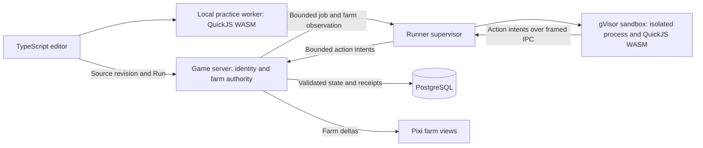

TypeScript farming implementation plan — September 19, 2026

Build a miniature programmable farm that players open from their laptop and can display in their office. Start with one charming robot, a small plot, and a few commands. Players plant, observe, write TypeScript, watch the robot work, and improve their program to handle more interesting crops and equipment.

The main inspiration is the continuous farming, programming, and technology progression in [The Farmer Was Replaced](https://store.steampowered.com/app/2060160/The_Farmer_Was_Replaced/). [Bitburner](https://store.steampowered.com/app/1812820/Bitburner/) is the secondary reference for programming as the primary interaction. The proposed gameplay and architecture below are our design, with original artwork and progression.

This develops the farm proposal in [economy gameplay ideas](economy-gameplay-ideas-2026-09-17.md). TypeScript is the player language. This document changes no game behavior, rewards, dependencies, or artwork. Prices, limits, capacity figures, and performance thresholds below are proposed starting points for validation.

The subsequent [performance investigation](typescript-farming-performance-2026-09-19.md) adds local interpreter/process measurements and an existing-server baseline. It identifies false timeouts with the proposed 5 ms wall deadline, startup and compilation costs, and the need for an aggregate runner CPU ceiling. Use its admission guidance and validation gates before selecting deployment limits; the 32-run ceiling below is not a proven capacity for an arbitrary server.

**The first release should make one small farm satisfying to program.**

| Stage | Player activity | New programming problem |
| --- | --- | --- |
| First harvest | Open a practice plot from the existing laptop, try plant/water/harvest, then run a short supplied program. | Read state and call a function. |
| First automation | Tend one cell automatically; add movement across a 3×3 plot. | Conditions, loops, coordinates, and `await`. |
| Better routes | Expand to 5×5 and eventually 8×8; compare useful harvests against wasted actions. | Functions, arrays, traversal, and planning. |
| Crop combinations | Add byte berries with a moisture window and a crop with a useful neighbor bonus. Keep the rules visible through inspection. | Scheduling and state-dependent decisions. |
| Equipment | Add irrigation and sensors, then cosmetic robot shells and farm decorations. | Choose between different strategies and reduce repeated work. |

Use crop resources for research and server-issued produce orders for coins. Keep experimentation useful after reaching the coin allowance: players can improve routes, unlock crop knowledge, and decorate. Basic seeds and the first water supply should permit recovery from a bad program without paying coins. An error stops the robot; completed work and purchased equipment remain intact.

Humor belongs in the action: a robot proudly waters an empty cell, a ripe root vegetable resists being pulled, a full crate does a little bounce. Errors still identify the failing call and source line clearly.

The first playable slice contains a 3×3 grid, one crop, one robot, a laptop entry point, manual controls, a TypeScript editor, and a local practice run. The first production release adds a personally owned farm kit, three crops, expansion up to 8×8, a small upgrade path, and coin settlement. Multiple robots, cooperative ownership, coffee production, SaaS simulations, competitions, and community script sharing follow later.

Practice is accessible through a laptop in inventory, so learning does not depend on placing furniture. Create farm state when the player starts the activity. Bind production to the purchased farm's owned-asset ID; its placed object is a display and access point. Storing, moving, or replacing that display preserves the program and progression. Selling or donating the production asset stops its run and requires an explicit disposition rule before those actions are enabled; production ownership never silently follows a shared display.

**Use the existing rendering and networking foundations, with a dedicated automation module.**

| Current foundation | Evidence | Implementation consequence |
| --- | --- | --- |
| React client and PixiJS 8 renderer | [Client dependencies](../apps/client/package.json), [WorldCanvas](../apps/client/src/components/WorldCanvas.tsx) | Render the farm with Pixi sprites; load the editor and simulation tools when opened. |
| Blockbench models rendered into directional atlases | [Generator](../scripts/world-assets/blockbench/generate.mjs), [renderer](../scripts/world-assets/blockbench/render.cjs), [importer](../scripts/world-assets/blockbench/import.mjs) | Author new models and animations through this pipeline. Runtime 3D is unnecessary for the proposed presentation. |
| Artwork metadata describes one looping animation per asset | [Artwork types](../apps/client/src/world-asset-artwork.ts), [texture playback](../apps/client/src/world-asset-textures.ts) | Add named action clips and one-shot playback before producing the full robot animation set. |
| Fastify, WebSockets, shared message types, strict Zod command parsing | [Server dependencies](../apps/server/package.json), [protocol](../apps/server/src/protocol.ts), [shared messages](../packages/shared/src/index.ts) | Add explicit automation commands and subscriptions; keep scripting out of the world tick. |
| World simulation runs every 50 ms | [World runtime](../apps/server/src/world/world-runtime.ts) | Schedule farm actions separately and deliver compact visual updates through the existing connection. |
| Serialized whole-workspace persistence and economy replay checks | [Application persistence](../apps/server/src/app.ts), [workspace repository](../apps/server/src/persistence/postgresql-workspace-repository.ts), [economy store](../apps/server/src/economy/economy-store.ts) | Frequent farm checkpoints need dedicated storage; money settlement must coordinate with the existing writer. |
| Docker Compose deploys the application and PostgreSQL | [Compose configuration](../compose.yaml) | Add a separately isolated runner deployment. Production host support for that isolation remains to be verified. |

Represent each farm as a bounded grid inside its own simulation. Crops and the robot are farm entities, avoiding hundreds of new room-layout objects, collision checks, and ownership records. The office display and the enlarged farm view render the same authoritative state.

**Offer ordinary TypeScript with a small, typed game API.**

Use CodeMirror 6 with its [TypeScript language support](https://github.com/codemirror/lang-javascript), plus a TypeScript language-service worker for semantic completion and diagnostics. The language package supplies editing support; the language-service integration is additional work. Lazy-load both. Test physical keyboard, touch selection, and the Android soft keyboard early.

Start with one `main.ts` file exporting `main`. Support functions, loops, arrays, objects, types, and `async`/`await`. Teach one feature at a time through small editable examples. Unlock game capabilities through progression while keeping language features available from the start.

| Proposed API | Behavior |
| --- | --- |
| `farm.inspect()` | Returns a copied snapshot of the robot's cell: crop, growth, moisture, and harvest readiness. |
| `farm.size()` / `bot.position()` | Returns grid dimensions / the robot's coordinates. |
| `bot.move(direction)` | Moves one cell within the grid. |
| `bot.plant(crop)` | Plants an unlocked crop using the farm's resources. |
| `bot.water()` / `bot.harvest()` | Acts on the current cell. |
| `farm.wait(ticks)` | Yields until the requested bounded number of simulation ticks elapses. |
| `console.log(...)` | Writes bounded text to this run's console. |

For example, the first program can automate a single cell:

```ts
export async function main(): Promise<void> {
  while (true) {
    const tile = farm.inspect();

    if (tile.harvestable) {
      await bot.harvest();
    } else if (tile.crop === null) {
      await bot.plant("carrot");
    } else if (tile.needsWater) {
      await bot.water();
    } else {
      await farm.wait(1);
    }
  }
}
```

Robot actions return promises. Each action consumes simulation time and resolves with the next authorized observation. Permit one outstanding action per farm; reject overlapping calls with a useful error. A missing `await`, `Promise.all`, or a tight retry loop must not create a large command queue. Invalid actions consume a scheduling opportunity but do not mutate the farm. Reads observe the last supplied snapshot and cannot advance time.

Keep the initial environment self-contained: one entry module, bundled standard-library declarations, and the game API declarations. Imports, npm packages, filesystem access, network calls, DOM access, timers, and native application bridges are outside this environment. Disable module loading in the interpreter as well as reporting unsupported imports in the editor. Supply simulation time and seeded randomness; test the exposed time APIs so wall-clock time, locale, and ambient entropy cannot affect simulation outcomes.

Use a pinned TypeScript compiler with a virtual, in-memory file system. It may read only the entry file and bundled declarations, without automatic type acquisition, path resolution into the host, compiler plugins, or user-provided compiler configuration. Source is compiled again for production; client-emitted JavaScript and client diagnostics are not authoritative. Compilation and type checking also receive time and memory limits. TypeScript's [compiler API](https://github.com/microsoft/TypeScript/wiki/Using-the-Compiler-API) distinguishes a program with diagnostics from simple transpilation; erasing types is neither type validation nor isolation.

Store the source revision, source hash, compiler version, API version, simulation version, and generated source map with each run. Edits create a draft; Run replaces the active revision at an action boundary. Map runtime errors back to the TypeScript line. Changing engine or API versions ends existing runs and starts the current implementation cleanly.

The editor needs the farm view, Run, Pause, Step, Reset practice, a program selector, and a collapsible console/API reference. Step advances to the next game action; arbitrary JavaScript instruction stepping and variable inspection are later work. Practice can run faster against a disposable state copy. Production uses server time and its prescribed action rate. Reset applies only to practice. On narrow screens, switch between Farm and Code while keeping execution controls reachable. Use visible crop state and action animation to explain progress; show explanatory text when an error or blocked action needs recovery.

**Treat all player code, runner output, and client results as untrusted.**

The recommended execution engine to prototype is QuickJS compiled to WASM through `quickjs-emscripten`. It supports explicit host bindings and promise scheduling, allowing game actions to suspend and resume a program under our control. This is a candidate to validate against the selected pinned version, not a claim that the application already has a secure sandbox. [QuickJS bindings](https://github.com/justjake/quickjs-emscripten)



The local worker provides instant practice feedback and can be terminated independently of the UI. Player JavaScript runs inside QuickJS/WASM, never through the worker's host `eval`, `Function`, or imports. Expose no authentication tokens, app state objects, Tauri APIs, or communication primitive beyond the bounded game bridge. Local results have no coin value.

For production, run one active player's interpreter in a dedicated, disposable process inside a gVisor sandbox on an isolated Linux runner host. Keep the game server, database, authentication service, and connected-service credentials outside that host. Do not put different players in contexts sharing one interpreter heap or one guest process. Compile in separate disposable, resource-limited jobs so compiler memory is not retained by every running farm.

The supervisor communicates with guests using bounded, framed stdin/stdout or dedicated inherited pipes. Guests need no IP networking. A broker outside the guest talks to the game service over a narrowly authenticated internal channel. It has no database access or economy write credentials. Bind each channel/job to a server-created run ID, farm ID, revision, and expiring lease; derive identity from that binding rather than guest-supplied account fields.

Use gVisor's syscall isolation together with a non-root user, dropped capabilities, no-new-privileges, a read-only image, size-limited temporary storage, PID limits, and cgroup CPU/memory limits. Mount no application directories, secrets, host devices, or container-management sockets into guests. Disable guest networking, including DNS, metadata-service access, and access to the database network. The supervisor owns sandbox creation and destruction. gVisor describes its [security boundary and exclusions](https://gvisor.dev/docs/architecture_guide/security/) and [Docker runtime setup](https://gvisor.dev/docs/user_guide/quick_start/docker/); this deployment still requires environment-specific validation and maintenance.

The proposed protections address different failures:

| Threat | Required control |
| --- | --- |
| Escape into application credentials or infrastructure | Minimal guest capabilities, WASM interpreter, isolated process, gVisor, separate runner host, no guest network or sensitive mounts. |
| Endless loops, recursion, promise storms, slow native operations | Interpreter interrupt budget plus an external process watchdog and OS resource limits. The watchdog must not share the blocked interpreter event loop. |
| Compiler exhaustion or malicious type references | Bounded isolated compilation, fixed virtual files, no host resolution, source-size and compile-rate limits. |
| Forged harvests, impossible movement, or faster execution | Server validates each intent against its own farm state, clock, unlocked tools, resources, and cooldowns. |
| Repeated or late commands | Run fencing, sequence numbers, expected state revisions, expiry, and bounded replay receipts. Stop revokes the run before killing its process. |
| Duplicate income | Server-issued order IDs, persisted completion evidence, atomic consumption and settlement, and unique receipts. |
| Cross-player access | Ownership checks at API, run admission, each command, and subscriptions; filter observations to the assigned farm. |
| Protocol, console, or UI attacks | Validate sizes before parsing, accept exact primitive fields, reject unknown operations, bound output, render logs as text. |
| Capacity exhaustion across many starts | Per-account start/compile quotas, one live run per account, global admission limits, a bounded fair queue, and circuit breakers. |

Build host bindings from copied primitive arguments and serialized game snapshots. Never pass host objects, callbacks, prototypes, or service references into the guest. Conversions, getters, proxies, error formatting, and console serialization are part of metered execution. Limit string lengths before copying across the bridge; bound messages again in the supervisor and server. A compromised runner must still be unable to mint resources or select another player's farm.

Accepting an intent is separate from applying it. Resume the interpreter under a budget; only dispatch its pending action once that execution slice has yielded successfully. The authority assigns the earliest permitted simulation tick, validates the action, applies it once, and returns the resulting observation. An error, timeout, invalid lease, or stale revision discards uncommitted intent. Score successful game actions and outcomes; interrupt-callback counts are not a portable instruction count.

QuickJS exposes memory, stack, and interrupt controls, but these do not replace process limits or an external watchdog. [QuickJS runtime controls](https://bellard.org/quickjs/quickjs.html#Memory-handling) Node explicitly says [`node:vm` is not a security mechanism](https://nodejs.org/api/vm.html). A worker thread, source-code blacklist, AST rewrite, or type checker alone does not meet this design's boundary. Leave production scripting unavailable when the required sandbox cannot start; do not switch to executing in the game process.

Start the security spike with these tunable limits:

| Resource | Proposed initial limit |
| --- | --- |
| Program storage | 32 KiB source; 128 KiB emitted code; 10 saved programs per player. |
| Compilation | 2 s wall deadline, 512 MiB process memory, two concurrent compile slots per test runner host. |
| Interpreter | 16 MiB guest heap and 512 KiB stack; 256 MiB for the entire runtime process/sandbox. Measure WASM and supervisor overhead separately. |
| Execution | 5 ms interrupt deadline per resume; an external 100 ms execution watchdog; 50 ms total CPU per second per run, also bounded by cgroups. Waiting for a game action does not consume the execution deadline. |
| Game bridge | One outstanding action; at most five action opportunities per second; at most 100 observation calls per resume; 16 KiB maximum IPC frame. |
| Console | 4 KiB/s, 1 KiB per line, and a 64 KiB retained ring buffer. |
| Admission | One live run per account; six production starts/compiles per minute, burst two; 32 live runs and a 32-entry admission queue per initial test host. |

These are ceilings, not resources reserved for every player. Enforce aggregate CPU, memory, storage, and queue limits as well as individual limits. A runtime timeout permanently revokes that run and retains source plus committed farm state; catching an interpreter exception cannot reset its budget. Repeated failures back off; they must not generate an automatic restart storm. Recycle completed sandboxes before assigning another tenant, retain operational metrics rather than source code in routine logs, and maintain an emergency switch to stop all production runs.

**Keep the simulation deterministic and the economy authoritative.**

Implement crop growth, movement, resources, and order rules as a pure TypeScript reducer with an explicit logical tick and seed. Reuse that reducer in local practice and on the server. Bound grid dimensions, inventory capacity, numeric counters, pending orders, and persisted state size; validate finite safe integers at input boundaries. Determinism applies to accepted game actions; host scheduling delays and timeouts can end a run without becoming gameplay bonuses. Client animation and rendering speed never advance production.

Use a maximum five farm scheduling opportunities per second, with some actions consuming multiple opportunities. Track the next growth/action event and skip sleeping farms. Persist the logical tick, pending action, next event, and RNG state. Animation events carry action ID, direction, start tick, and duration; the client interpolates them without sending a packet per frame.

| State | Proposed contents and lifetime |
| --- | --- |
| Farm | Owner, owned asset, dimensions, cells, robot position, resources, upgrades, tick, RNG state, revision, and checkpoint. |
| Program | Owner, bounded source, immutable revision/hash, selected entry, and compiler/API/simulation versions. |
| Run lease | Farm, source revision, status, deadline, sequence, and fencing generation. Ephemeral execution is separate from durable farm progress. |
| Order | Server-issued ID, requirements, payout, production classification, expiry, and completion state. |
| Production accounting | Account plus UTC production day, earned amount, pending payout balance, and unique completion/collection receipts. |

The current reward rules are a 250-coin welcome grant, daily bonuses of 10/15/20/25/30/35/50, and a shared 100-coin daily game allowance. [Existing economy constants](../packages/shared/src/economy.ts) Keep the earlier proposal of **at most 25 additional production coins per player per UTC day**, shared across every future production activity. This cap is proposed, not currently implemented. Manual and scripted tending use the same production allowance. Practice pays nothing. Separate optional challenges can later use the existing active-game allowance with their own validated completion evidence.

At order completion, atomically consume the required produce, mark the order complete, reserve the permitted amount against that production day, and add it to a pending payout buffer capped at 25 coins. Collection transfers that reserved value to the wallet once. Persist the production day when earned; collection on a later date does not create a new allowance. Stop coin-bearing orders when the buffer is full. Reject completions that cannot fit rather than silently consuming produce for a reduced payout. Selling crop output through the furniture shop is not a conversion route.

Implement settlement through the application's single serialized persistence coordinator. Frequent farm-only checkpoints go to dedicated farm rows and stay outside the blanket workspace row synchronizer. A money operation stages farm consumption, production accounting, receipt, and the existing economy snapshot in **one PostgreSQL transaction**, then publishes success. Coordinate existing wallet mutations and background workspace saves with this writer so an older snapshot cannot overwrite a settled balance. Do not introduce a second independent wallet writer. Use database uniqueness and account/day locking in addition to the application's queue. The initial deployment has one authoritative game writer per workspace; runner parallelism does not change that constraint.

Ordinary farm checkpoints can be batched every two seconds; a crash may lose that much unclaimed activity. Money, orders, purchases, and explicit saved programs require durable acknowledgement. Fence stale checkpoints so they cannot restore consumed produce after settlement. On database failure, stop the affected economic operation and publish no payout. Test a wallet purchase racing a claim and a background snapshot, as well as the usual duplicate-claim case.

Extend the canonical [transaction kind and restore validation](../apps/server/src/economy/economy-store.ts) and [database constraints](../apps/server/src/persistence/entities/workspace-entities.ts) for production receipts. Preserve existing purchase-cost and one-third resale rules for durable purchases. Give paid upgrades attributable receipts. Research and crops do not acquire invented resale value. User deletion, workspace reset, backup, and restore must include automation state.

For initial balance tests:

| Purchase | Proposed coins | Purpose |
| --- | ---: | --- |
| Production farm kit, 3×3, one robot | 150 | Affordable from the welcome grant after trying practice. |
| 5×5 expansion | 500 | Introduces more useful route planning. |
| Irrigation module | 650 | Changes the program's work distribution. |
| 8×8 expansion | 1,200 | A longer saving target with harder crop layouts. |
| Robot shells and farm decorations | 75–400 | Ongoing optional spending. |

Equipment improves possibilities and efficiency within the same payout cap. At the full proposed 25/day, earning back a 500-coin purchase from production alone takes at least 20 days; upgrades that do not increase actual completed output add no income. The mature maximum across daily bonus, existing games, and production would be 175/day. Test the combined economy and completion pace before committing prices. Target a first useful script in about 10–15 minutes and enough crop/tool combinations to make later purchases more than a speed multiplier.

**Add unattended production after the online loop is reliable.**

For the first production milestone, a run continues while its owner has an authenticated connection, with a short reconnect grace period. Closing the editor leaves the run visible in the world. Pause stops the farm's logical simulation; Stop revokes its lease. The server continues to own all timing, including when a browser tab is throttled.

The next milestone adds an explicit Deploy action that grants up to 24 hours of unattended work. It runs the same validated program and simulation, sleeps between events, and stops when the lease expires, the payout buffer fills, or resource limits are reached. Estimate its actual runner cost before enabling it broadly. Additional machines or disconnected clients never increase the account's production allowance.

Persist farm state, not a JavaScript heap, call stack, or promise continuation. After a runner/server restart, end the old run and show it as paused; the player can start `main` again against the saved farm. Exclude downtime from simulation progress in the initial unattended release. Do not infer income from a client-reported rate or attempt unbounded replay of hours of code. Automatic restart or catch-up would be a separate feature with explicit checkpoint semantics and a strict replay-work limit.

**Create a compact Blockbench asset set with readable actions.**

Match the existing office palette, outlines, projection, and calibrated ground scale. Make the robot and crops legible both in the enlarged farm and as a small office display. Maintain editable `.bbmodel` files, named animation groups, and reproducible generation sources.

| Asset | Required states/clips | Delivery priority |
| --- | --- | --- |
| Farm tray and modular soil | Empty, planted, moist, dry; clear cell boundaries. | Prototype and first release. |
| Farm robot | Idle, move, plant, water, harvest, blocked, celebrate; four directions. | One complete silhouette first, cosmetic shells later. |
| Carrot/root crop | Seed, sprout, growing, ripe; growth pop and harvest reaction. | Prototype. |
| Two additional crops | Distinct silhouettes, growth stages, and visible mechanic state. | Production release. |
| Dock, water supply, produce crate | Refill, working, full, and delivery reaction as applicable. | Production release. |
| Irrigation and decorations | Short working clip; mostly static when idle. | Upgrade milestone. |

Extend the exporter/importer and artwork schema to identify `clip → direction → frames`, with duration, loop/one-shot behavior, fixed ground pivot, and union bounds across each action. Existing looping props move to this single format with an idle clip when the format is introduced; regenerate their manifests and remove the superseded format. Keep generic atlas playback in shared renderer code and farm-specific state selection in the automation module.

Render Blockbench animations to atlases during asset generation. Start with roughly 8–12 sampled frames per second and interpolate robot position independently at display rate. Growth stages are small static variants; brief action clips supply personality. Reuse geometry, textures, and clip timing across shells instead of duplicating entire animation libraries for color changes.

Continue through the existing content-addressed lossless WebP delivery pipeline and small shop previews. Limit farm atlas pages to 2,048×2,048 initially and load only needed clips/materials. One RGBA page of that size is 16 MiB before mipmaps; compressed download size does not measure GPU memory. The current [texture loader](../apps/client/src/world-asset-textures.ts) enables mipmaps, so account for roughly one-third extra texture storage plus decoded images and other caches.

Review every direction and clip for pivot drift, edge clipping, shadow alignment, crop/robot occlusion, loop closure, and correct one-shot endings. Show contact sheets at actual game size. Reduced motion uses clear static states and restrained transitions while preserving the information needed to play. Animation completion never authorizes a harvest or payout.

**Measure frame time, execution cost, and network volume before scaling the farm.**

Batch sprites sharing atlases, reuse texture regions, pool short-lived effects, and update only changed farm cells. Keep frame animation out of React state updates. Suspend animation work for hidden farm views; test whether culling improves the actual scene. Avoid per-crop filters and repeated texture uploads. These choices fit Pixi's guidance on [sprites, textures, and rendering cost](https://pixijs.com/8.x/guides/concepts/performance-tips).

Send a bounded farm snapshot on subscription and versioned deltas afterward, up to five updates per second for active viewers. Keep large source files and private console data out of world broadcasts. Visibility follows existing floor/room access. Unsubscribe distant or hidden detailed views, use a low-frequency overview for the office display, and resynchronize on revision gaps. Apply backpressure to slow sockets; an accumulating event queue must not consume unbounded memory.

Use a separate runner host for the first capacity test: provisionally 8 vCPU and 16 GiB, with the 32-run admission ceiling above. This is a test configuration, not a hosting requirement or proven capacity. At 50 ms CPU/s per admitted run, the guest CPU allowance alone totals 1.6 cores. Thirty-two 256 MiB sandbox ceilings total 8 GiB before compiler jobs, gVisor, the supervisor, and host overhead. Admit fewer jobs if measured aggregate headroom requires it.

Enforce a shared operating-system CPU ceiling across runtimes, compilation, startup, and supervision; limiting only the broker or each player's interpreter is insufficient. Budget startup separately from normal resumes, distinguish CPU time from elapsed deadlines, and measure cached-code starts separately from compilation. The [follow-up measurements](typescript-farming-performance-2026-09-19.md) explain why the execution and start-time targets below require calibration under the actual Linux quotas.

| Area | Proposed acceptance target | Representative scenario |
| --- | --- | --- |
| Client frame time | Desktop p95 ≤16.7 ms; target mobile p95 ≤33.3 ms; farm rendering adds ≤2 ms to the desktop baseline. | Editor plus 8×8 farm; office scene with 20 visible farm displays. Record hardware, resolution, and browser. |
| Client responsiveness | No new main-thread task over 50 ms during ordinary editing or execution after loading. | Large allowed source, typing while animating, open/close/reopen, and stopped infinite loops. |
| Texture memory | ≤64 MiB additional GPU texture allocation for the loaded farm set, including mipmaps. | All first-release action clips plus current crop states. Also measure decoded-image and cache memory. |
| Production start | Warm start p95 <500 ms on the test deployment; measure cold start separately. | 32 admitted runs with bounded compilation traffic and recorded network RTT. |
| Server responsiveness | Existing world tick remains within its 50 ms interval at p99; p99 event-loop delay increases by <5 ms from baseline. | 32 active farms, 100 subscribed clients, existing movement/game traffic, and adversarial jobs. |
| Farm network traffic | Average <2 KiB/s per detailed farm subscription after the initial snapshot. | Normal farming; logs measured and limited separately. |
| Recovery and memory | Stop acknowledgement within 250 ms at p95; stable memory after repeated start/stop and a one-hour soak. | Tight loops, allocations, promise floods, reconnects, and forced runner death. |

Watch queue delay, admitted runs, per-run CPU/RSS, watchdog kills, compilation failures, IPC volume, farm-delta bytes, checkpoint latency, settlement conflicts, and client frame time. Load-test the actual dependency versions and sandbox image. If cost or responsiveness misses a target, reduce admitted concurrency or artwork size before expanding grid sizes or adding robots. Do not relax isolation to reach a performance number.

**Implement in milestones with explicit exit criteria.**

| Milestone | Work | Ready when |
| --- | --- | --- |
| 1. Security and runtime spike | Pin QuickJS/WASM and TypeScript; bounded virtual compilation; async action bridge; process watchdog; gVisor deployment; minimal load harness. | Infinite loops, built-in slow operations, allocations, recursion, imports, promise storms, malformed IPC, and cross-run attempts are contained. The actual Linux host passes network/mount/credential isolation checks. |
| 2. Playable farm | Pure reducer, 3×3 carrot plot, manual actions, CodeMirror, types/completion, local practice, pause/step/error recovery. | A new player can adapt the starter script, see a useful result, and understand a failure. The sample program and preview produce the same transitions as the server reducer. |
| 3. Animated presentation | Named-clip pipeline, robot, crop, soil, dock, world display, touch layout, reduced motion. | Every clip/direction passes artwork checks, and the representative farm scene meets its frame/memory budgets. |
| 4. Authoritative online production | Source revisions, run admission, action validation, private subscriptions, owned-asset persistence, transactional production accounting, coin buffer, collection. | Duplicate, stale, forged, and racing requests cannot create coins or restore spent produce. Kill/restart and PostgreSQL failure tests preserve acknowledged balances. |
| 5. Progression and balance | More crops, 5×5/8×8 expansion, irrigation, cosmetic purchases, price/session experiments. | The farm remains fun after automating the first crop; combined income and purchases preserve the intended progression pace. |
| 6. Unattended work and release hardening | Bounded deployment leases, event-based sleeping, reconnect/restart behavior, abuse testing, operational dashboards, sandbox patching/kill procedure. | Long-running and idle farms stay within capacity, stop cleanly at limits, and recover without duplicate settlement. Independent security review precedes broad exposure. |

Plan provisionally for about 6–10 engineering weeks for a small team, with dedicated Blockbench art time overlapping milestones 2–5 and a separate security review. This is a sizing assumption, not a delivery commitment: deployment support, editor integration, asset iteration, and persistence coordination are the largest unknowns. Milestone 1 is the technical gate; milestone 2 is the gameplay gate. Produce a playable review build after each milestone.

Suggested code ownership keeps the large existing world files focused:

| Location | Responsibility |
| --- | --- |
| New `packages/automation-sim/` | Pure farm state, rules, ticks, seeds, and determinism tests; shared by preview and server. |
| New `packages/automation-runtime/` | Compiler configuration, script API declarations, QuickJS bridge, serialization limits, and browser/server runtime conformance. |
| `packages/shared/src/automation/` | Application command/event contracts and shared economy-facing types. Keep interpreter/compiler dependencies out of the general shared package. |
| New `apps/automation-runner/` | Supervisor, compiler jobs, isolated runtime process, admission, health, and metrics. |
| New `apps/server/src/automation/` | Run authorization, scheduler, order generation, server validation, settlement orchestration, and subscriptions. |
| `apps/server/src/persistence/` and migrations | Farm/program/order/receipt tables, checkpoint fencing, coordinator integration, restore and deletion behavior. |
| New `apps/client/src/automation/` | Editor, language worker, local preview worker, farm renderer, action controls, and subscription state. |
| `scripts/world-assets/blockbench/` | Farm model sources, clip exporter/importer changes, atlas generation, and visual checks. |

Add focused tests for reducer invariants and replay; runtime termination and boundary conversion; quota fairness; source-map errors; pause/step; cross-account isolation; UTC rollover; duplicate completion/collection; multiple tabs; stale leases; asset storage/sale; checkpoint/settlement races; and restart/database failures. Execute sandbox penetration and resource tests against the production isolation stack, separately from unit tests. Browser checks cover desktop and narrow layouts, keyboard/touch input, animation synchronization, reduced motion, and worker cleanup. PostgreSQL integration tests verify actual constraints and transaction rollback.

The implementation must also pass the existing lint, typecheck, test, production build, world-artwork, and optimized-image checks. New databases start without farm/demo records; test scenarios use isolated fixtures. Production rollout is gated by the security, persistence, performance, and gameplay outcomes above, with a feature switch that can revoke all active runs.

For this planning change, the repository architecture, economy constants, rendering pipeline, and persistence behavior were inspected, and the referenced primary documentation was checked. All 20 local document links resolve. The sample passed strict TypeScript 5.9.3 checking against declarations for the proposed API; whitespace checks passed. These checks do not execute or validate the proposed game API. No game server, sandbox service, migration, asset generation, browser gameplay session, capacity benchmark, or security audit was run. Actual runner-host compatibility, performance, player learning time, prices, and the estimate remain to be validated during implementation.
