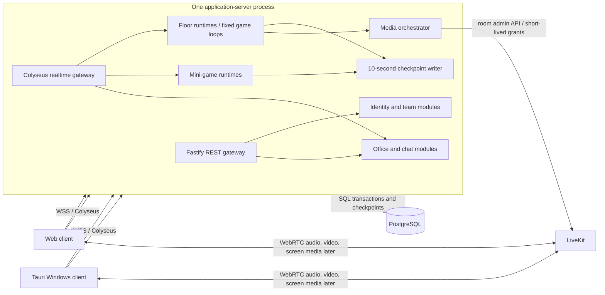
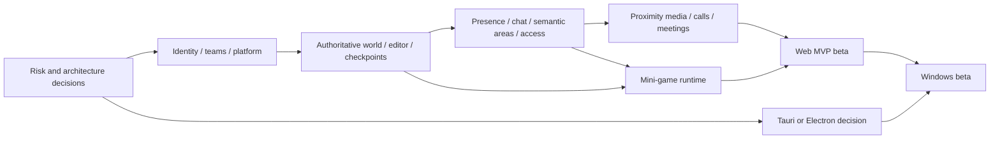

# Virtual Office Game — Product and Technical Specification

**Status:** Planning baseline; no implementation has been started  
**Research reviewed:** 29 August 2026  
**Workspace context:** Greenfield. The workspace contained no product source, configuration, or prior architecture to preserve.

This document uses three scope labels:

- **Required** — explicitly requested capability or constraint.
- **Proposed** — recommended product or technical decision needed to turn the requirements into an implementable product.
- **Future** — intentionally outside the initial release, but accounted for at a boundary where doing so is inexpensive.

The recommended initial product is a web-first, low-art virtual office for distributed teams. A single authoritative Node.js application server owns world simulation and exposes both REST and WebSocket interfaces. PostgreSQL stores durable data; active world state lives in memory and is checkpointed every 10 seconds. LiveKit supplies WebRTC media. The Windows client wraps the same web application with Tauri 2, subject to an early audio/video validation gate.

## 1. Product vision and target experience

### 1.1 Vision

Create an online office that is useful even when nobody is in a meeting: coworkers can see who is around, understand whether they are open to interruption, move naturally between work and social spaces, ask a quick question, hold a real meeting, or start a small game without changing tools or coordinating a link.

The experience should feel like a persistent place, not a video grid decorated as a game. The world supplies shared context; work remains the reason to return; play makes the place socially valuable.

### 1.2 Target users

**Proposed initial segment:** remote-first or hybrid software, creative, and professional-services teams with 5–100 members. The first load target is 100 concurrent WebSocket users on one application server, up to 50 active avatars on one floor, up to 12 camera publishers in one meeting, and up to 8 simultaneous participants in an ambient proximity group. These are validation targets, not product limits or scale promises.

Primary users are:

- Team members who keep the office open during part of the workday.
- Team administrators who invite people and shape the office.
- Small groups that need fast, informal collaboration more often than formal scheduled calls.
- Distributed teams that want optional social play without turning work into mandatory gamification.

### 1.3 Target experience

A successful daily experience looks like this:

1. A member opens the web or Windows client and returns to their last safe position.
2. Their square appears online; their chosen availability is visible.
3. They can work with the office in a compact/background mode or move around the full world.
4. They click a destination or use directional controls. The client feels immediate, while the server determines the legal path and final position.
5. Walking into a talking lounge enables an ambient conversation. Walking near a coworker also exposes a lightweight wave or direct-call action.
6. Entering a meeting area offers full and small call actions; the call opens only after the member chooses one.
7. At a desk, lounge, office, or arcade object, the available action is clear from context.
8. An authorized editor can extend the office in any direction, draw walls, place objects, and define the behavior of an area while coworkers remain online.
9. A member can start the falling-block mini-game without leaving the office, then return to the same place.

### 1.4 Product principles

- **Work useful, socially warm.** Presence, interruption control, chat, and meetings matter before decoration or rewards.
- **Consent before interruption.** Proximity creates opportunity, not permission to override a busy or do-not-disturb state.
- **The world is shared truth.** Movement, collision, access, layouts, mini-games, and proximity membership are server-authoritative.
- **Low-fi first.** Initial avatars, walls, floors, objects, and game blocks are colored rectangles. Art direction cannot block validation of behavior.
- **World and interface have separate jobs.** PixiJS renders the high-frequency world; standard accessible UI handles forms, chat, meetings, and administration.
- **Persistent place, disposable session.** Durable office structure and communication survive restarts; ephemeral connections and media sessions do not pretend to.
- **One deployable first.** Keep a modular monolith and explicit domain boundaries, but do not add service discovery, queues, Redis, Kubernetes, or federation before load requires them.
- **No surveillance product by default.** Presence communicates availability. It should not silently become employee productivity scoring.

### 1.5 Initial visual language

**Required:** use simple colored squares as initial visual assets.

The first renderer therefore uses:

- A colored square per avatar, with initials in the accessible DOM participant list rather than baked into the canvas.
- Solid rectangles for floors, walls, doors, desks, lounge seats, meeting tables, portals, and game objects.
- Distinct fill colors and simple outlines for area types.
- A grid overlay only while editing.
- Color-independent cues in the interface—labels, icons, patterns, focus rings, and status text—so color is not the only source of meaning.

No sprite pipeline, character animation system, asset marketplace, or tile-art dependency belongs in the MVP.

### 1.6 Proposed experience objectives

These should become measured beta criteria:

| Objective | Proposed target |
|---|---:|
| Warm return to an office | interactive in under 3 seconds at p75 on a typical broadband connection |
| Cold authenticated load | interactive in under 5 seconds at p75 |
| Local movement input feedback | under 50 ms before client prediction is visible |
| Server movement acknowledgement | under 150 ms at p95 within the launch region |
| Accepted direct call to audible media | under 2.5 seconds at p75 |
| Reconnect after a brief network drop | resume within 5 seconds where the session remains valid |
| World simulation | 20 Hz, with fewer than 1% of ticks exceeding 50 ms under target load |
| Live-state recovery point | no more than 10 seconds of acknowledged transient world progress lost after an ungraceful stop while PostgreSQL is available |

## 2. Research-informed feature set and proposed differentiators

Research used current public product pages, help documentation, roadmaps, and official technical documentation. Competitor claims are treated as category signals, not independent performance or usability benchmarks; the Phase 0 pilot and technical spikes must validate them against this product's users and constraints.

### 2.1 Market baseline

Gather establishes the central pattern: visible availability, walk-up spatial audio/video, waves or rings, desks, private meeting areas, map editing, chat, meetings, and a desktop mini mode. Its current feature page also treats channels, DMs, threads, meeting chat, recording, screen sharing, calendar integration, and AI notes as part of a broader communication suite. Gather describes 2.0 specifically as a rebuild around real-time presence, a new interface, and new integrations ([Gather features](https://www.gather.town/features), [Gather 1.0 versus 2.0](https://support.gather.town/articles/2163640255-gather-1-0-vs-gather-2-0), [status behavior](https://support.gather.town/articles/3094704589-set-your-status-available-busy-and-do-not-disturb), [walk-up conversations](https://support.gather.town/articles/4772337318-start-conversations-wave-ring-and-walk-over)).

Gather's private areas isolate audio/video from outsiders and can be locked while a meeting is in progress. Its editor separates floors/rooms, backgrounds, objects, and tile effects, and supports substantial customization ([private areas](https://support.gather.town/articles/2550999600-overview-of-meeting-rooms-private-areas), [Mapmaker](https://support.gather.town/articles/9657827678-mapmaker-overview), [desk behavior](https://support.gather.town/articles/3227467030-claim-and-customize-your-desk)). Gather 2.0's public roadmap shows that multiple floors, mobile support, SSO, pets, richer chat controls, and MCP access remain meaningful expectations rather than solved details ([Gather roadmap](https://www.gather.town/roadmap)).

Comparable products reinforce the same baseline from different angles:

| Product | Research signal | Implication for this product |
|---|---|---|
| Kumospace | Movement, spatial audio, configurable status, nearby/floor/group chat, games, whiteboards, screen sharing, and desktop/mobile apps are all presented as normal virtual-office capabilities ([virtual office](https://www.kumospace.com/virtual-office), [chat](https://www.kumospace.com/help/chat)). | Presence, proximity media, chat scope, and low-friction navigation are table stakes. Nearby chat may be ephemeral while durable team chat remains searchable. |
| SpatialChat | Free movement, flexible rooms, spatial audio, private/public chat, private areas, roles, and very large presentation rooms are core product concepts ([virtual office](https://spatial.chat/product/virtual-office)). | Separate conversational areas from large broadcast/meeting semantics; do not model every gathering as one proximity bubble. |
| SoWork | A Sims-like editor, instant meetings, simple/mini modes, rich objects, AI meeting memory, focus sessions, games, pets, and MCP/API integrations show where the category is expanding ([product](https://www.sowork.com/product/virtual-office), [July 2026 release](https://www.sowork.com/whats-new)). | A compact work mode and extensible activity objects are worthwhile. AI, active-app sharing, and deep analytics require explicit privacy decisions and are not MVP defaults. |
| WorkAdventure | Open-source/self-hosted deployment, customizable worlds, approach-triggered video, persistent and proximity chat, and extensible maps demonstrate demand for ownership and community operation ([project](https://github.com/workadventure/workadventure), [chat model](https://docs.workadventu.re/user/chat/)). | Keep hosting, protocol, and world ownership boundaries clear even while shipping only one official server first. |

Two additional lessons matter:

1. **Audio/video reliability is a primary product feature.** Gather publicly described rebuilding part of its desktop audio pipeline in native C++ after JavaScript scheduling and Windows background-priority behavior caused call-quality failures ([Gather audio overhaul](https://www.gather.town/blog/behind-the-fix-audio-2026)). The Windows wrapper must therefore pass real low-spec and background-use tests before it is chosen irrevocably.
2. **Delight does not replace daily utility.** Current competitors lead with availability, fast conversations, chat, meetings, and focus modes; games, pets, decoration, and AI deepen retention after those foundations work.

### 2.2 Expected capabilities

The research and confirmed requirements produce this baseline:

- Team creation, invitation, role-based membership, removal, and invitation revocation.
- A persistent team office with one or more floors.
- Visible online/offline and interruption status.
- A participant directory and locate/follow action.
- Click-to-move and directional movement with collision.
- Ambient proximity audio/video and explicit direct calls.
- Durable team, area, meeting, and direct-message chat.
- Semantic areas for meetings, talking lounges, desks, and private offices.
- Private-area locking plus password- or invitation-based access.
- Focused meetings with camera feeds and meeting chat.
- Live, permissioned office editing.
- A compact Windows experience that can remain useful beside other work.
- Activities embedded in the world, starting with a falling-block puzzle.

### 2.3 Proposed differentiators

#### A. A genuinely authoritative editable world

Most virtual offices treat the map as presentation and the client as movement authority. Here the server owns paths, collision, access transitions, layout revisions, and simulation. That enables consistent private-area enforcement, future cooperative game objects, reproducible recovery, and safer community hosting.

#### B. Boundary-free office building

Editors can extend a sparse, chunked layout in any direction rather than choosing a fixed template size. Operational quotas limit stored cells and abusive commands, but the product does not present a rectangular map edge. This is a meaningful differentiator only if navigation, portals, undo, and chunk streaming remain responsive.

#### C. Semantic areas, not cosmetic labels

An area type changes behavior:

- **Meeting room:** focused media, capacity, access rules, meeting chat.
- **Talking lounge:** ambient media, join/leave hysteresis, optional coworking timer later.
- **Personal desk:** one member assignment, home position, desk-local interactions.
- **Private office:** owner or invite/password access, explicit knock flow.

Area behavior is data-driven, so later area types can be added without rebuilding the renderer.

#### D. Consent-aware spontaneity

Walking near someone should make contact easy while preserving control. Available coworkers can receive a wave or call; busy coworkers receive a quieter request; do-not-disturb coworkers cannot be rung. Private spaces never become accessible merely because an avatar is geometrically close.

#### E. A small, safe game platform

Mini-games are first-class server modules with typed input/state contracts, lifecycle limits, and result persistence. The initial puzzle proves the platform. Later games can be added without giving untrusted code database or network access.

#### F. Hosting boundaries without federation complexity

The initial system is one application server. Stable world IDs, versioned protocols, provider interfaces, and room ownership boundaries keep a future self-hosted distribution possible. Global account federation, cross-host movement, and distributed consensus are deliberately absent.

#### G. Low-fi validation as a product advantage

Colored squares make collision, pathfinding, interaction ranges, status, layout editing, and call transitions observable early. Visual polish begins only after teams demonstrate repeat daily use.

### 2.4 Proposed engagement ideas after the core works

These are **not initial requirements**:

- Lightweight waves, reactions, paper notes, or a ball-toss interaction.
- Team-created rituals such as a timed coffee lounge or end-of-day game queue.
- Desk guestbooks or gifts with strict notification controls.
- Cooperative office goals that unlock decorative colors, not work-performance rewards.
- Spectating mini-games without joining.
- Opt-in music/activity surfaces.

Avoid streaks based on hours online, leaderboards for work presence, or mechanics that reward performative availability.

## 3. MVP scope versus later phases

### 3.1 MVP definition

The web MVP is complete when one real team can create an account, invite coworkers, build and use one persistent floor, understand presence, move under server authority, chat, hold public and private conversations, run a camera meeting, and play the first mini-game through a browser. It must survive a server restart within the defined persistence guarantees.

| Capability | MVP | Later phase | Notes |
|---|:---:|:---:|---|
| Email/password account and sessions | Yes | SSO/OIDC later | Authentication approach is an implementation proposal, not a requirement. |
| Team invitations and membership | Yes | Directory sync later | Owner, admin, member, and scoped guest access. |
| Shared virtual office | Yes | Templates/import-export later | One active office per team is enough for MVP; model supports more. |
| Colored-square rendering | Yes | Character art/customization later | No sprite dependency in MVP. |
| One floor | Yes | Multiple floors in next product phase | Floor identity and portals exist in the data model from the start. |
| Available/busy/do-not-disturb/away/offline | Yes | Calendar-derived status later | Only offline is derived; the others are user or idle state. |
| Team chat, area chat, DMs, meeting chat | Yes | Threads, reactions, files, exports later | Text and safe links only. |
| Meeting, lounge, desk, private-office areas | Yes | Additional presets later | Behavior is configurable within safe bounds. |
| Click-to-move and directional movement | Yes | Follow/lead later | Server computes paths and resolves collision. |
| Nearby ambient conversation | Yes | Tunable spatial profiles later | Public areas only. |
| Explicit nearby direct calls | Yes | Offline calling/mobile push later | Ring, accept, decline, end. |
| Live camera/microphone meetings with chat | Yes | Screen share, recording, calendar later | No recording in MVP. |
| Password/invitation private rooms | Yes | Domain allowlists/waiting rooms later | Access is checked by the application server. |
| Live office editor | Yes | Templates, asset uploads, collaborative cursors later | Walls, floor cells, colored objects, areas, spawn point. |
| Boundary-free layout extension | Yes | Cross-floor copy/paste later | Sparse chunks and quotas. |
| Falling-block mini-game | Yes | Multiplayer variants and more games later | Solo, spectators, durable high scores. |
| Native Windows package | Planned immediately after web MVP | Rich mini/desk mode follows | Tauri decision gate occurs before web MVP freezes. |
| Android | No | Future | Reassess Tauri WebView versus a native Kotlin shell when mobile scope is known. |
| Pets, customization | No | Future | Renderer/model extension points only. |
| AI and MCP | No | Future | Explicit permissions and audit model required first. |
| Community hosting | No | Future | Deployment boundary is prepared; distribution is not built. |

### 3.2 Explicit MVP non-goals

- Pixel-art production assets, character animation, cosmetics, or pets.
- Calendar integration, SSO, SCIM, recording, transcription, or AI summaries.
- File uploads, embedded arbitrary websites, user-authored scripts, or a public game marketplace.
- Cross-team public discovery or a global social network.
- Cross-server travel, federation, or migration of accounts between community hosts.
- Horizontal application-server scaling, Redis, Kafka, Kubernetes, or a service mesh.
- Android support.
- Employee activity analytics beyond operationally necessary aggregate metrics.
- Exact restoration of a live media connection after a server restart.

### 3.3 Post-MVP sequencing

1. **Workday quality:** Windows client, compact mode, notification controls, screen sharing, reconnection polish, accessibility, and administrative audit history.
2. **Space growth:** multiple floors, portals, office templates, copy/paste, richer objects, and larger load targets.
3. **Social depth:** additional first-party games, spectators, optional character customization, pets, and team rituals.
4. **Enterprise readiness:** SSO/OIDC, SCIM, data retention controls, exports, moderation, and regional/data-residency options.
5. **Platform and hosting:** documented server package, media self-hosting, protocol compatibility policy, installed mini-game packages, and a server discovery manifest.
6. **AI/MCP:** scoped tools for presence queries, meeting knowledge, status changes, or office actions only after consent, auditing, and data-retention policies are mature.

## 4. User roles, key flows, and functional requirements

### 4.1 Roles and permissions

| Role | Scope | Core permissions |
|---|---|---|
| Team owner | Team | All team and office administration; transfer ownership; delete team; assign admins. Exactly one active owner is proposed. |
| Team admin | Team | Invite/remove non-owner members, manage roles below owner, create/edit offices and areas, manage room access, moderate shared chat. |
| Member | Team | Enter team offices, use chat/media/games, claim or use an assigned desk, edit own profile/status. |
| Guest | Office, area, or meeting | Enter only explicitly granted resources; no team directory export, layout editing, or team administration. Guest support is required for invitation-protected private meetings, but can be hidden from the main product until external access is enabled. |

**Proposed permission refinement:** layout editing is a capability granted to admins by default and optionally to selected members. It is not a separate global role. This avoids role proliferation while allowing a team to appoint builders.

Every authorization decision is evaluated against the resource's `team_id`, membership state, role/capability, and any area-specific access rule. Being connected to a floor is never sufficient authorization for a command.

### 4.2 Key flows

#### Flow A — Create a team and invite coworkers

1. An authenticated user creates a team and becomes owner.
2. The owner enters one or more email addresses and selects the member role.
3. The server creates single-use, expiring invitations and sends links through the configured mail provider.
4. An existing user accepts after authentication. A new user creates and verifies an account first.
5. Acceptance is transactional: validate token hash, email restriction, expiry, revocation, and existing membership; create membership; mark invitation accepted.
6. The team roster and online clients receive a membership event.

Failure states must distinguish an expired, revoked, already-used, wrong-email, and unauthorized invitation, with a direct recovery action where one exists.

#### Flow B — Enter or resume the office

1. The client obtains office metadata and a short-lived, single-use WebSocket join ticket over REST.
2. The WebSocket handshake validates origin and ticket; the floor room rechecks membership/access.
3. The server chooses the last saved position if still valid, otherwise the nearest safe cell to it, otherwise the floor spawn.
4. The client receives the dynamic room state plus the layout chunks around the spawn/viewport.
5. Presence changes to online with the member's saved availability. Media remains off until the member enables it or joins a call.
6. A dropped connection receives a 15-second reconnection grace. After grace, the derived presence becomes offline.

#### Flow C — Move and encounter coworkers

1. Click movement sends a destination, not a client-computed path. Directional movement sends sequenced input vectors.
2. The server validates the input, computes or updates the path, advances the avatar during fixed ticks, resolves collision, and acknowledges input sequence numbers.
3. The local client predicts only its own short movement and reconciles to authoritative snapshots; remote avatars are interpolated.
4. The server recomputes area membership and proximity groups. Clients receive conversational availability, but private-area access is checked before a boundary can be crossed.

#### Flow D — Start a direct call

1. A member selects a nearby coworker and chooses Call.
2. The server checks team relationship, floor, range, block state, availability, existing call state, and rate limits.
3. The recipient sees a ring with accept/decline. Do-not-disturb rejects without ringing.
4. On acceptance, the server creates a dedicated media-session identity and issues short-lived LiveKit grants to both participants.
5. Both clients join; call state is reflected in presence. Either participant can end it.

#### Flow E — Enter a private meeting room

1. Movement reaches a private boundary or the member chooses the room from the directory.
2. Membership/invitation rules are evaluated. If a password is required and no active grant exists, movement stops at the boundary and the password form opens.
3. A valid password or invitation creates a time-limited area access grant for that user/session.
4. The server moves the avatar across the boundary and issues a private media-room grant only when the user joins the meeting.
5. Meeting chat is durable and scoped to authorized participants.

#### Flow F — Edit the live office

1. An authorized editor enters edit mode and subscribes to visible chunks.
2. Each drag/paint gesture becomes one bounded batch command against a known floor revision.
3. The client previews locally; the server validates permission, quotas, schema, overlaps, protected spawn/portal rules, and revision.
4. The server applies the batch atomically, increments the revision, updates collision/navigation data, persists the durable layout transaction, and broadcasts the delta.
5. If the base revision is stale and changes overlap, the command is rejected with the current affected chunk; non-overlapping commands may be rebased by the server.
6. Any avatar made invalid is moved to the nearest safe position. Active paths crossing changed cells are recalculated.

#### Flow G — Play the initial mini-game

1. A member interacts with a placed arcade object.
2. The server creates or joins a game room and verifies the definition, capacity, and office access.
3. The client lazy-loads the mini-game view. Input is sequenced; the server owns randomization, board state, score, and completion.
4. Results are persisted immediately. Active game state follows the same 10-second checkpoint policy as world state.
5. Leaving returns the member to the saved safe office position.

### 4.3 Functional requirements

#### Identity, teams, and access

- **FR-IDENT-01 — Required:** Users can create an account, authenticate, refresh a session, log out, and revoke other sessions.
- **FR-TEAM-01 — Required:** An owner can create a team and invite people by email.
- **FR-TEAM-02 — Required:** Invitations are single use, revocable, expire after a proposed seven days, and may be reissued.
- **FR-TEAM-03 — Required:** Owners/admins can list members, change permitted roles, and remove members. Ownership transfer is atomic.
- **FR-TEAM-04 — Proposed:** One user can belong to multiple teams; every request carries an explicit team/resource identifier rather than an implicit global current team.
- **FR-ACCESS-01 — Required:** Office and area entry supports invitation rules and password protection.
- **FR-ACCESS-02 — Required:** Password success creates a scoped grant; raw passwords are never stored or returned.
- **FR-ACCESS-03 — Required:** A membership or access revocation disconnects or relocates affected live sessions promptly.

#### Office, floors, areas, and desks

- **FR-OFFICE-01 — Required:** A team has at least one persistent shared office.
- **FR-FLOOR-01 — Proposed for MVP foundation:** Every world entity belongs to a floor even while only one floor is exposed.
- **FR-FLOOR-02 — Future:** Offices can contain multiple floors connected by authorized portals/elevators.
- **FR-AREA-01 — Required:** Editors can create meeting rooms, talking lounges, desk areas, and private offices from rectangles initially; polygon masks may follow.
- **FR-AREA-02 — Required:** Area type controls media, access, capacity, and available actions.
- **FR-DESK-01 — Required:** A personal desk can be assigned to one member and acts as a home/locate position.
- **FR-DESK-02 — Proposed:** A member can return to their desk using server pathfinding, but cannot teleport through locked areas.

#### Presence and movement

- **FR-PRES-01 — Required:** The system exposes available and offline states.
- **FR-PRES-02 — Proposed:** It also exposes busy, do-not-disturb, and away. Offline is derived from connections; away is derived from idle behavior unless explicitly disabled.
- **FR-PRES-03 — Required:** Multiple sessions aggregate into one user presence. The user is offline only when no authorized session remains after grace.
- **FR-MOVE-01 — Required:** Users can move freely with click-to-move and directional controls.
- **FR-MOVE-02 — Required:** The server computes click paths and is authoritative for speed, collision, destination, boundaries, and floor transitions.
- **FR-MOVE-03 — Required:** Clients never submit final positions or collision results as facts.
- **FR-MOVE-04 — Proposed:** A locate action reveals a teammate's floor/area only when policy allows; exact coordinates remain an internal live detail.

#### Chat and meetings

- **FR-CHAT-01 — Required:** Members can send team chat, area chat, direct messages, and meeting chat.
- **FR-CHAT-02 — Required:** Durable messages are stored before the sender receives a success acknowledgement and can be fetched with cursor pagination.
- **FR-CHAT-03 — Proposed:** Nearby ambient chat is ephemeral and visible only to the current proximity group; users choose a durable area chat when history is intended.
- **FR-CHAT-04 — Required:** Message submission is idempotent and ordered within a conversation.
- **FR-MEDIA-01 — Required:** Nearby coworkers can start an explicit direct audio/video call with accept/decline.
- **FR-MEDIA-02 — Required:** Meeting rooms provide live microphone/camera feeds and meeting chat.
- **FR-MEDIA-03 — Required:** Private media is issued only after application authorization; knowing a media-room name is insufficient.
- **FR-MEDIA-04 — Proposed:** Camera and microphone start disabled until a user grants browser permission and chooses to publish.
- **FR-MEDIA-05 — Future:** Screen sharing, recording, transcription, calendar scheduling, and large broadcast mode.

#### Layout editing

- **FR-EDIT-01 — Required:** Authorized team members can place/delete floor cells, walls, doors, colored objects, areas, spawn points, desks, and portals.
- **FR-EDIT-02 — Required:** The editable map has no product-level fixed width or height and may grow in positive or negative coordinates.
- **FR-EDIT-03 — Required:** A layout edit is a bounded atomic command with a base revision and deterministic validation.
- **FR-EDIT-04 — Required:** Accepted edits update live collision/pathfinding and all subscribed clients.
- **FR-EDIT-05 — Proposed:** Undo/redo is command-based for the current editor session; a full historical editor is later.
- **FR-EDIT-06 — Required:** Server quotas cap batch size, object count, occupied chunks, coordinate magnitude, and pathfinding work to prevent denial of service. These are safety limits, not visible map boundaries.

#### Mini-games and persistence

- **FR-GAME-01 — Required:** The server can register multiple mini-game definitions without coupling them to the office simulation module.
- **FR-GAME-02 — Required:** The first game is a server-authoritative falling-block puzzle rendered with colored squares.
- **FR-GAME-03 — Proposed:** The MVP supports solo play, spectating, and team high scores; competitive garbage-line multiplayer follows later.
- **FR-PERSIST-01 — Required:** Active live state is held in memory and checkpointed to PostgreSQL every 10 seconds while dirty.
- **FR-PERSIST-02 — Required:** The server loads the latest saved state once during startup before accepting world connections.
- **FR-PERSIST-03 — Required:** Graceful shutdown attempts a final checkpoint; an ungraceful stop may lose at most the last 10 seconds of transient progress under normal database availability.
- **FR-PERSIST-04 — Proposed:** Identity, membership, access, chat, layout revisions, and completed game results are durable transactions and are not delayed behind the live-state checkpoint interval.

#### Clients and accessibility

- **FR-CLIENT-01 — Required:** The primary client runs in supported evergreen desktop browsers.
- **FR-CLIENT-02 — Required:** A packaged Windows client is planned on the same protocol and user-interface codebase.
- **FR-CLIENT-03 — Future:** Android uses the same REST/WebSocket contracts but may use a platform-native LiveKit SDK if WebView media does not meet quality targets.
- **FR-A11Y-01 — Required:** Every world action available through pointer interaction has a keyboard-accessible interface counterpart where practical.
- **FR-A11Y-02 — Required:** Status, access, and error meaning cannot rely on color alone. Chat, forms, meeting controls, and participant lists use semantic DOM and tested focus order.

## 5. Real-time architecture and data-flow design

### 5.1 Initial deployment shape

The first release is a **modular monolith in one application-server process**. REST, WebSocket upgrade handling, authoritative floor rooms, mini-game rooms, checkpoint scheduling, and media orchestration are composed in that process. PostgreSQL and the WebRTC SFU are external dependencies because they solve different operational problems; they are not application microservices.

Fastify and Colyseus reuse one underlying Node HTTP server and one public origin. This preserves a simple deployment and certificate boundary while allowing each framework to do the job it fits: conventional business REST versus fixed-step authoritative rooms and binary state patches.

### 5.2 Module boundaries inside the process

| Module | Owns | Must not own |
|---|---|---|
| Identity | credentials, sessions, email verification | team authorization rules or world state |
| Teams | teams, memberships, invitations, role/capability evaluation | floor simulation |
| Offices | offices, floors, durable layout revisions, areas, desks, access policies | media transport |
| World runtime | active avatars, inputs, paths, collision, occupancy, proximity, transient checkpoints | account credentials or SQL query details |
| Chat | conversations, messages, delivery cursors, ephemeral typing/nearby chat | WebRTC media |
| Meetings/media | application media sessions, authorization, LiveKit adapter, webhooks | authoritative avatar coordinates |
| Mini-games | game registry, instances, inputs, scores, game checkpoints | direct access to membership tables or arbitrary network calls |
| Persistence | repositories, transactions, migrations, checkpoint serialization | product decisions |
| Transport | REST schemas, WebSocket room adapters, connection lifecycle | domain rules beyond boundary validation |

Domain services take typed commands and return typed results. Transport handlers translate; they do not contain movement, membership, room-access, or scoring rules.

### 5.3 State classes and source of truth

| State class | Runtime source of truth | Persistence behavior |
|---|---|---|
| Accounts, credentials, sessions | PostgreSQL | Transactional immediately. Cached session lookups may be short-lived but never authoritative. |
| Teams, memberships, invitations, access policies | PostgreSQL plus read-through in-process cache | Transactional immediately; cache invalidated after commit. |
| Layout, areas, desks, portals | Latest committed floor layout revision in PostgreSQL, mirrored in memory | Each accepted edit is a durable transaction before it becomes the published live revision. |
| Durable chat | PostgreSQL | Insert before success acknowledgement, then deliver over WebSocket. |
| Avatar positions, current paths, occupancy, presence connections | In-memory floor runtime | Dirty checkpoints at most once every 10 seconds; final best-effort flush on graceful stop. |
| Availability preference | In memory while connected; last explicit preference in PostgreSQL | Explicit changes persist asynchronously outside the tick; derived online/offline/away state is not restored as online. |
| Proximity groups and active public conversations | In-memory floor runtime | Recomputed after startup; not durable. |
| Active direct calls and meetings | Application memory plus LiveKit | Session metadata may be audited; media connection state is not restored. |
| Active mini-game boards | In-memory game runtime | Dirty checkpoint every 10 seconds; finished result/high score is an immediate durable transaction. |

This split satisfies the required write-behind behavior without delaying security- or collaboration-critical records. The explicit **live-state persistence duration is 10 seconds**. A shorter interval creates unnecessary database churn at the initial scale; a longer interval makes avatar and active-game recovery noticeably stale. The interval is configuration with a production minimum of 5 seconds and maximum of 30 seconds, but 10 seconds is the supported default and test target.

### 5.4 Startup and shutdown sequence

The application follows a strict startup gate:

1. Validate configuration and secrets.
2. Connect to PostgreSQL and apply/verify schema migrations through a deployment job.
3. Acquire a PostgreSQL advisory lease proving that this deployment is the sole owner of the initial world runtime. If another owner is active, startup fails; split-brain is worse than downtime.
4. Load team/office/floor topology, current layout revisions, area rules, object data, and the newest valid live-state checkpoint **once** into the world registry.
5. Verify checkpoint schema version, checksum, floor/layout revision, and entity references. Invalid positions are repaired to a safe cell; presence sessions load as offline.
6. Rebuild collision grids, chunk adjacency, path caches, and area indexes from durable layouts.
7. Mark checkpointed mini-games suspended and allow their players a proposed five-minute resume window.
8. Start floor/game loops, REST readiness, then WebSocket admission in that order.

No floor lazily reloads its saved state on each join in the initial architecture. Chat history remains database-paged and is not loaded wholesale.

On shutdown the server stops new joins, marks readiness false, stops accepting durable mutations, drains current tick work, writes a final dirty checkpoint with a timeout, closes media sessions, releases the lease, and closes network/database connections. A process kill can still lose the most recent 10 seconds of transient state, which is the declared recovery point.

### 5.5 Fixed-step simulation

Each active `FloorRuntime` has an independent logical clock but runs within the one Node process:

- **Simulation rate:** 20 Hz fixed timestep (`dt = 50 ms`).
- **State patch rate:** 10 Hz for ordinary office motion; urgent discrete events are sent immediately and reliably.
- **Client render rate:** display refresh rate, normally 60 Hz, with interpolation about 100 ms behind remote authoritative snapshots.
- **Input:** sequenced and timestamped against the server clock. Directional input is sampled once per client simulation step; click targets are discrete commands.
- **Catch-up:** process at most a small bounded number of missed steps after a stall. Never run an unbounded spiral of catch-up ticks; record a dropped-tick metric and continue from authoritative time.

A floor tick performs only deterministic, bounded in-memory work:

1. Drain the bounded input queue.
2. Validate movement/status/action intents.
3. Advance incremental path searches within their budget.
4. Advance avatars and resolve static collision.
5. Re-evaluate areas, access boundaries, portal triggers, and proximity memberships.
6. Advance floor-local interactive objects.
7. Mark changed synchronized fields and checkpoint dirtiness.
8. Queue, but do not await, chat/media/persistence side effects.

Database calls, email, LiveKit admin calls, and large serialization never run in the tick callback. Their result returns as a command to a later tick when it changes world state.

### 5.6 Room and interest partitioning

- One Colyseus `FloorRoom` maps to one active floor instance and owns its simulation.
- A separate `MiniGameRoom` maps to one mini-game instance.
- A member may hold a floor connection and one game connection. The server limits connections per account/device.
- Dynamic entities and small presence fields use Colyseus schema state and binary delta patches. Colyseus rooms are authoritative and clients request rather than directly mutate state ([Colyseus state synchronization](https://docs.colyseus.io/state)).
- The unbounded layout is **not** placed in a single synchronized room collection. Initial nearby chunks arrive at join; reliable `layout.chunk_snapshot` and `layout.chunk_delta` messages stream only authorized chunks intersecting the server-approved viewport/interest window.
- Exact dynamic positions can use per-client state views for nearby entities; the floor roster can still expose coarse area/floor presence. State views are not used as a large-dataset paging system.
- Interest recalculation occurs only when a client crosses a chunk/area threshold or deliberately changes zoom, not every render frame.

### 5.7 REST versus WebSocket responsibility

**REST is for** authentication, session rotation, team and membership administration, invitations, office/floor metadata, initial/configuration reads, cursor-paged chat history, layout export, durable scoreboards, and issuance of short-lived WebSocket/media grants.

**WebSocket is for** floor join/resume, movement intent, authoritative patches, presence, chat send/delivery, call state, live layout edit commands and deltas, area transitions, meetings while live, and mini-game input/state.

The same business command has one canonical execution path even if exposed through more than one transport later. REST must not become a second implementation of a WebSocket rule.

### 5.8 Command, acknowledgement, and ordering model

Every explicit client command contains:

- Protocol version.
- Connection/session identity supplied by the transport, never trusted from payload.
- Command type.
- Client-generated request ID for correlation and idempotency.
- Monotonic input sequence where ordering matters.
- Expected resource revision for edits.
- Typed payload validated at ingress.

Every response/event carries the relevant request ID, floor/game server tick, resource revision, and a stable error code when rejected. State-changing commands are idempotent within a bounded deduplication window. Chat also stores the client request ID under a conversation-scoped uniqueness constraint.

Ordering guarantees are deliberately narrow:

- Movement input: ordered per connection; old or duplicate inputs are ignored and acknowledged with the last applied sequence.
- Layout edits: serialized per floor revision.
- Chat: ordered per conversation using a server-assigned sequence, not wall-clock time.
- Membership/access changes: PostgreSQL transaction order plus an in-process invalidation event.
- There is no expensive global event order across all teams and features.

### 5.9 Failure and recovery behavior

| Failure | Required behavior |
|---|---|
| Short client network loss | Hold the avatar and room seat for 15 seconds; stop movement; attempt Colyseus reconnection; do not duplicate the user entity. |
| Reconnect after grace | Reauthorize through a new join ticket and create a new connection epoch. Last valid checkpoint/position may be used. |
| Application restart | Load latest checkpoint once, mark everyone offline, rebuild derived indexes, require new media sessions. |
| PostgreSQL unavailable | Continue already-running transient movement for a bounded 60-second proposed grace, but reject/disable new durable commands. Stop readiness and disconnect safely if checkpoint age or pending durable work exceeds bounds. Never acknowledge an uncommitted chat/layout/member change. |
| LiveKit unavailable | World, presence, movement, and chat remain usable. New media joins fail with a retryable error; the application does not implement a second media stack. |
| Slow client | Coalesce replaceable state, cap outbound buffered bytes, then disconnect with a resumable code rather than exhausting server memory. |
| Layout changes beneath an avatar | Move the avatar to the nearest safe cell and send the reason. Recompute active routes whose navigation revision is stale. |
| Checkpoint incompatible/corrupt | Quarantine it, alert, restore from the newest prior valid checkpoint or durable spawn. Do not partially deserialize unknown state. |

### 5.10 Consistency goals

- Membership, invitation, access policy, layout, chat, and completed score operations: transactional, read-your-writes after acknowledgement.
- Live movement and active game state: eventual durability with 10-second RPO.
- Remote rendering: eventually consistent with server state; temporary prediction is presentation, never authority.
- Presence: soft state. Accuracy target is within one heartbeat/grace interval, not transactional history.
- Media participant state: LiveKit is transport truth; the application remains authorization and product-session truth. Webhooks reconcile unexpected disconnects but do not override application access policy.

## 6. Recommended frontend, backend, networking, database, media, and desktop technologies, with rationale

### 6.1 Recommended stack

Use latest compatible stable patch versions and commit an exact lockfile. The reviewed baseline is:

| Layer | Recommendation | Rationale and important trade-off |
|---|---|---|
| Language | Strict TypeScript for web, server, protocol, and game rules; minimal Rust for the Tauri shell | One domain language keeps movement/game contracts shared and testable. Rust is restricted to native capabilities rather than creating a second business-logic implementation. |
| Runtime | Node.js 24 LTS | Current LTS as reviewed; mature production tooling and direct support for the chosen frameworks ([Node releases](https://nodejs.org/en/download/current)). CPU-heavy work must remain bounded because one event loop owns the initial process. |
| Monorepo | pnpm workspace; ordinary package scripts initially | Fast, deterministic workspace installs and shared packages without adding a task orchestrator before build times justify it. |
| Web application | React 19.2, Vite, TypeScript | React is well suited to chat, forms, settings, meetings, and accessible overlays; Vite provides a lean SPA build and first-class TypeScript/worker support ([React versions](https://react.dev/versions), [Vite guide](https://vite.dev/guide/)). Do not drive 20/60 Hz world motion through React component state. |
| World renderer | PixiJS 8 using the WebGL renderer | A focused high-performance 2D renderer matches the colored-square world. Pixi's own guidance still recommends WebGL for production while WebGPU browser behavior matures ([Pixi renderers](https://pixijs.com/8.x/guides/components/renderers)). |
| UI data/state | TanStack Query for REST cache; a small Zustand store for local interface state; Colyseus state callbacks for live world projections | Keeps server data, local panels, and high-frequency world state separate. Avoid copying every room patch into multiple global stores. |
| UI styling/accessibility | CSS Modules plus a small set of accessible headless primitives such as Radix UI | Predictable static styling and semantic controls without committing the product to a large themed component system. Canvas actions receive DOM alternatives. |
| REST server | Fastify 5 with TypeBox JSON schemas and generated OpenAPI | Low overhead, plugin boundaries, and compiled request/response validation. Fastify recommends schema-based validation and serialization ([Fastify](https://fastify.dev/), [validation](https://fastify.dev/docs/latest/Reference/Validation-and-Serialization/)). |
| Realtime/game server | Colyseus 0.18 core plus default `ws` transport, attached to the Fastify HTTP server | Authoritative rooms, fixed timesteps, typed input, reconnection, delta state sync, prediction/reconciliation, and a future room-scaling boundary are a direct fit ([Colyseus overview](https://docs.colyseus.io/), [room game loop](https://docs.colyseus.io/room), [netcode](https://docs.colyseus.io/netcode)). It introduces framework state-schema coupling, so durable domain models stay independent of Colyseus classes. |
| Wire formats | Colyseus binary schema patches for continuous state; typed small messages for commands; JSON REST | Avoid inventing snapshot/delta encoding. JSON remains inspectable for low-frequency business APIs. Layout chunks may use MessagePack only after measurement proves JSON to be material. |
| Database | PostgreSQL 18 | Transactions, constraints, relational team/access data, cursor queries, and JSONB for bounded object properties in one operational datastore. PostgreSQL cautions that large JSONB document updates lock the whole row, supporting the proposed per-chunk rather than whole-map documents ([PostgreSQL JSON types](https://www.postgresql.org/docs/18/datatype-json.html)). |
| Data access | MikroORM with its PostgreSQL driver and checked-in migrations | Typed entities, transactional repositories, and an explicit migration history ([MikroORM PostgreSQL](https://mikro-orm.io/docs/usage-with-sql), [migrations](https://mikro-orm.io/docs/migrations)). |
| Media | LiveKit Cloud for MVP; `MediaProvider` adapter compatible with self-hosted LiveKit | An SFU is necessary beyond tiny calls. LiveKit supports WebRTC rooms, selective subscription, adaptive stream, server administration, web and Android SDKs, and identical core APIs for cloud/self-hosting ([LiveKit architecture](https://docs.livekit.io/reference/internals/livekit-sfu/), [self-hosting](https://docs.livekit.io/transport/self-hosting/)). Managed media removes TURN/SFU operations from the first application release. |
| Windows | Tauri 2 with WebView2 and a narrow capability allowlist | Reuses the web client, produces a small native package, supports system tray/notifications/updating, and preserves an Android option ([Tauri 2](https://tauri.app/)). The trade-off is WebView and WebRTC variability; an early AV/background/screen-capture test gate is mandatory. |
| Tests | Vitest for domain/component tests; Playwright for web end-to-end; deterministic simulation harnesses; Windows native smoke tests | The simulation clock and random source are injected for reproducibility. Playwright covers Chromium, Firefox, and WebKit browser behavior ([Playwright browsers](https://playwright.dev/docs/browsers)). Tauri-native behavior needs Rust tests and signed Windows smoke builds rather than pretending browser automation covers it. |
| Observability | Pino structured logs, OpenTelemetry traces/metrics, Prometheus-compatible metrics backend | Tick time, event-loop delay, room load, media quality, and checkpoint lag need first-class visibility. OpenTelemetry JS traces and metrics are stable ([OpenTelemetry JS](https://opentelemetry.io/docs/languages/js/)). |
| Deployment | One OCI container for the application; managed PostgreSQL; static web assets from the same origin or a CDN; LiveKit Cloud | Minimal moving parts. A reverse proxy/load balancer terminates TLS and supports WebSocket upgrades. No orchestrator is required at initial scale. |

### 6.2 Frontend composition

The web application has two rendering planes:

1. **World canvas:** a single Pixi application owns camera, colored primitives, chunk display, interpolation, pointer hit testing, and edit preview. It consumes a narrow projected world store and mutates display objects directly on frame updates.
2. **Application DOM:** React owns authentication, team switcher, directory, status, chat, access forms, editor controls, meeting tiles, mini-game shell, errors, and settings.

The canvas never contains passwords, chat text, meeting controls, or the only representation of a critical state. This keeps accessibility and security review tractable.

Use a platform adapter for notifications, secure token storage, window state, tray/mini-mode, deep links, and update checks. The browser implementation uses Web APIs; Tauri supplies native implementations. Domain and transport packages must not import Tauri APIs.

### 6.3 Why PixiJS instead of Phaser or a DOM grid

- Phaser is a capable client game engine, but its scene/physics/input stack would overlap with an authoritative custom world simulation and encourage client-side game logic to become canonical.
- DOM elements do not scale or interpolate as predictably for a panning world with many floor/object cells.
- Pixi gives rendering, batching, input hit testing, and a scene graph without prescribing physics, networking, or gameplay architecture.
- WebGL is the production renderer. WebGPU can be evaluated later behind an implementation branch, not shipped as runtime fallback behavior.

### 6.4 Why Colyseus instead of raw WebSockets or Socket.IO

Colyseus directly supplies room lifecycle, heartbeat/reconnection, server-owned schema state, binary deltas, fixed timesteps, input acknowledgement, and prediction hooks. Its default patch rate is designed around real-time rooms, and its room boundary naturally becomes the future floor/game sharding unit.

Raw `ws` would reduce dependency coupling but require the team to design and maintain all of those facilities. Socket.IO adds a mature event abstraction and fallbacks that are not needed for an evergreen WSS-only client, while still leaving game state synchronization and fixed-loop semantics to the application.

The costs of Colyseus are framework-specific schemas and a less conventional business-API ecosystem. The architecture contains that cost by:

- Keeping durable domain entities and repositories plain TypeScript.
- Treating Colyseus state as a transport projection of the runtime, not the database model.
- Keeping REST in Fastify.
- Pinning the chosen 0.18 minor/patch until its newer netcode APIs have passed load and reconnect tests.

### 6.5 Why PostgreSQL instead of a document or in-memory database

Membership, invitations, role changes, room invitations, chat ordering, and layout revisions benefit from transactions, foreign keys, uniqueness, and row locking. Sparse layout chunks can use normalized keys and bounded JSONB properties without putting an entire floor in one document. The database is also sufficient for the initial checkpoint writer and small job-like workloads, so Redis and a separate document store add no initial value.

Do not query PostgreSQL for collision, proximity, or position every tick. It is the durable store, not the live simulation engine.

### 6.6 Media choice and topology

Raw peer-to-peer WebRTC works for roughly two or three peers but multiplies each publisher's upstream as group size grows. An SFU receives one publication and forwards selected tracks, preserving per-person audio control and flexible video layout ([LiveKit SFU rationale](https://docs.livekit.io/reference/internals/livekit-sfu/)).

LiveKit is preferred over building signaling/TURN/SFU logic or operating lower-level mediasoup because it includes:

- Browser, React, Android, and server SDKs.
- Short-lived room grants and backend participant administration.
- Adaptive stream and simulcast selection, which avoid decoding large offscreen video ([adaptive stream](https://docs.livekit.io/transport/media/subscribe/)).
- Selective subscriptions explicitly intended for spatial applications.
- A single-node self-host option without Redis and a documented multi-node path requiring Redis only later.
- Optional E2EE, ingress, egress, and recording when future product requirements justify them.

The application WebSocket remains the authority for proximity and calls. LiveKit data packets are not a second game/chat transport.

### 6.7 Windows shell recommendation and decision gate

**Primary recommendation:** Tauri 2, selected for a lightweight always-open application, one web interface, narrow native capabilities, signed updates, and a plausible Android reuse path.

This is a native Windows distribution in the product sense: an installed, signed executable with native tray, notification, credential, window, shortcut, and update integration. The shared world and application UI remain web-rendered inside WebView2; a fully native Windows UI would duplicate the primary web client without improving the core architecture.

Before committing to the Windows client milestone, run a two-week spike on representative Windows 11 machines, including low-spec hardware. It must validate:

- Camera/microphone permission, device switching, echo cancellation, and reconnect.
- LiveKit audio while the window is backgrounded, minimized, in compact mode, and during screen share.
- CPU, memory, battery, WebView2 update variation, and 8-hour soak behavior.
- Multi-monitor screen/window capture if screen sharing is moved into the Windows release.
- Tray, notifications, global mute shortcut, deep links, signed MSI/NSIS install, and signed updater.

If Tauri misses defined AV reliability or screen-capture criteria, choose Electron **before** desktop feature implementation and ship only Electron. Electron costs a larger bundle and memory footprint but provides a controlled Chromium version, mature desktop media APIs, and easier native audio extensions. Do not maintain both shells.

### 6.8 Android approach

Android is future work, not a promise that the desktop shell can simply be recompiled. Reuse domain types, REST/WebSocket protocol, React interface where it remains ergonomic, and world-rendering concepts. At the mobile design gate, compare:

- Tauri 2 Android with a reduced web interface.
- A Kotlin application using the LiveKit Android SDK and a lightweight native UI.

Mobile likely prioritizes chat, presence, direct calls, and meeting join before a full editor or large world. The server protocol must therefore not assume mouse input, desktop viewport size, or browser cookie storage.

### 6.9 Version and dependency policy

- Pin exact dependencies in the lockfile and use supported LTS runtime/container images.
- Renovate dependencies through reviewed, tested updates; do not auto-deploy major versions.
- Keep protocol versions and database migrations independent of package versions.
- Generate and compare REST OpenAPI plus WebSocket message schemas in CI.
- Avoid beta/experimental runtime dependencies in the critical path. In particular, do not depend on Pixi WebGPU or experimental large-collection streaming for MVP.

## 7. Domain model and major API/WebSocket responsibilities

### 7.1 Identifier and tenancy conventions

- Use application-generated UUIDv7 identifiers for durable entities and opaque random identifiers for public invitation/session tokens.
- Every team-owned row contains `team_id`, including resources reachable through another parent, to make tenant filters explicit and indexable.
- Time is UTC `timestamptz`; client locale affects presentation only.
- Mutable aggregate roots carry an integer `revision` for optimistic concurrency.
- Deletion is explicit. Security-sensitive revocation is immediate; soft deletion is used only when an audit/recovery requirement exists.
- Public tokens are stored as cryptographic hashes. Entity IDs are not authorization secrets.

### 7.2 Durable entities

| Entity | Important fields and relationships |
|---|---|
| `User` | `id`, verified email, display name, account state, created/updated timestamps. No team role is stored globally. |
| `Credential` | `user_id`, Argon2id password hash parameters, password-changed timestamp. Can later coexist with `IdentityProviderLink`. |
| `Session` | `id`, `user_id`, hashed refresh/session secret, device label, expiry, last-used time, revoked time. |
| `Team` | `id`, name, owner membership reference, settings revision, state. |
| `TeamMembership` | `team_id`, `user_id`, role, explicit capabilities, active/suspended state, joined time. Unique active membership per pair. |
| `TeamInvitation` | `team_id`, email restriction, intended role, token hash, invited-by user, expiry, accepted/revoked timestamps. |
| `Office` | `id`, `team_id`, name, default floor, revision, state. MVP exposes one active office but does not encode that as a permanent schema limit. |
| `Floor` | `id`, `office_id`, name, spawn position, current layout revision, state. |
| `LayoutRevision` | `floor_id`, monotonic revision, author, command batch metadata, committed time. Stores audit metadata, not a duplicate entire floor. |
| `LayoutChunk` | `floor_id`, signed `chunk_x/chunk_y`, revision, bounded cell/wall data, checksum. Primary key is floor plus coordinates. |
| `WorldObject` | `id`, `floor_id`, chunk key, type, transform, dimensions/collider, color, bounded typed properties, revision. Interactive behavior references an allow-listed object type. |
| `Area` | `id`, `floor_id`, type, name, shape/mask, media policy, capacity, access policy ID, revision. Shapes cannot overlap incompatibly under server rules. |
| `AreaAccessPolicy` | `id`, mode (`TEAM`, `INVITE`, `PASSWORD`, combinations), password hash if used, lock state, revision. |
| `AreaInvitation` | `area_id`, invited user/email, inviter, expiry/revocation, optional meeting scope. |
| `AreaAccessGrant` | `area_id`, `user_id` or guest identity, source, issued/expiry time, revoked time. Short-lived grants may remain in memory; durable grants are rows. |
| `DeskAssignment` | `area_id` or desk object ID, unique member, assigned time, optional home position. |
| `WorldPlayerState` | `user_id`, `floor_id`, position/facing, availability, room, connection state, and transient interaction expiry. |
| `Conversation` | `id`, `team_id`, type (`TEAM`, `AREA`, `DM`, `MEETING`, `GAME`), resource reference, title where needed, state. |
| `ConversationParticipant` | conversation/user relationship, join/leave, read cursor, notification preference. DM uniqueness is constrained by normalized participant set. |
| `ChatMessage` | `conversation_id`, sequence, sender, client request ID, plain-text body, created/edited/deleted timestamps. Attachments are absent in MVP. |
| `Meeting` | `id`, `team_id`, optional area, creator, title, scheduled/start/end times, state, associated conversation. Ad hoc meetings need no schedule. |
| `MeetingParticipant` | meeting/user or guest, access role, joined/left audit times. Media quality data is operational telemetry, not this row. |
| `MediaSession` | application session ID, kind, resource/user references, provider room name, start/end/reason. Provider secrets/tokens are never stored. |
| `MiniGameInstance` | `id`, team/floor/object, definition ID/version, state, seed, created/finished times. |
| `MiniGameParticipant` | instance/user, role, joined/left, final result. |
| `MiniGameResult` | instance, user/team, verified score, duration, ruleset version, completed time. |
| `WorkspaceSettings` | singleton key, typed game settings, updated time. Schema changes are handled by database migrations. |

### 7.3 In-memory entities

The runtime holds optimized representations rather than ORM objects:

- `FloorRuntime`: clock, current layout/navigation revision, players, object runtimes, chunk index, area spatial index, proximity manager, dirty persistence state.
- `PlayerRuntime`: connection set, fixed-point position/velocity, current authoritative input, route, current area, status, media state, last applied sequence.
- `NavigationChunk`: walkable/collision bitsets, boundary entrances, revision, neighbor costs.
- `PathSearch`: destination, navigation revision, open/closed sets, per-tick budget, cancellation state.
- `ProximityGroup`: public member set, entry/exit thresholds, media subscription plan.
- `GameRuntime`: definition adapter, deterministic clock/random source, participants, state, persistence dirtiness.

These objects never leak directly into REST responses or database records. Repositories map domain state to typed entities.

### 7.4 REST API responsibilities

All routes are under `/v1`. Names below define responsibility; exact pluralization can be finalized with the generated OpenAPI review.

| Area | Representative endpoints | Responsibility |
|---|---|---|
| Authentication | `POST /auth/register`, `/auth/login`, `/auth/refresh`, `/auth/logout`; `GET/DELETE /sessions` | Account/session lifecycle and CSRF/session rotation. |
| Teams | `GET/POST /teams`; `GET/PATCH /teams/{teamId}` | Create, list, and update team metadata. |
| Invitations | `POST/GET /teams/{teamId}/invitations`; `DELETE /.../{inviteId}`; `POST /invitations/{token}/accept` | Issue, list, revoke, inspect safely, and accept invitations. Raw tokens appear only in their delivery link. |
| Memberships | `GET /teams/{teamId}/members`; `PATCH/DELETE /.../{userId}` | Roster and role/capability management. |
| Offices/floors | `GET /teams/{teamId}/offices`; `POST /teams/{teamId}/offices`; `GET /offices/{officeId}`; `GET /floors/{floorId}` | Durable metadata and authorized discovery. Layout creation/editing remains a live command. |
| Join grants | `POST /floors/{floorId}/join-ticket` | Mint a 30-second, single-use, audience-bound ticket after authorization. |
| Areas | `GET /floors/{floorId}/areas`; `POST /areas/{areaId}/access-grants` | Directory data and password/invitation access exchange. Password is accepted only over TLS and never echoed. |
| Chat history | `GET /conversations`; `GET /conversations/{id}/messages?before=&limit=` | Discover authorized conversations and cursor-page durable history. Live send uses WebSocket. |
| Meetings/media | `POST /meetings`; `GET/PATCH /meetings/{id}`; `POST /media-sessions/{id}/grant` | Create/admit/end application sessions and mint short-lived provider grants. |
| Mini-games | `GET /mini-games`; `GET /mini-games/{definitionId}/scores` | List installed allow-listed definitions and verified results. Live instance actions use WebSocket. |
| Layout export | `GET /floors/{floorId}/layout?revision=` | Authorized diagnostic/export snapshot, streamed and rate limited. Not the normal game join path. |
| Operations | `GET /health/live`, `/health/ready`, `/version` | Process liveness, dependency/startup readiness, and protocol/build information. No secrets or tenant data. |

REST mutations accept an idempotency key where browser retries can duplicate a durable action. Lists use opaque cursor pagination. Errors use stable machine codes plus minimal user-safe messages; stack traces and provider detail stay in logs.

### 7.5 WebSocket room responsibilities and messages

Colyseus supplies the transport handshake, room lifecycle, state patches, heartbeat, and reconnection token. Application messages are grouped as follows.

#### Client to floor room

| Message | Purpose and validation |
|---|---|
| `movement.input` | Sequenced directional vector and buttons. Clamp values; reject impossible rate/sequence. |
| `movement.set_destination` | Floor, fixed-point target, and request ID. Server computes a route through connected stairs. |
| `movement.cancel` | Cancel current path without changing position. |
| `presence.set_availability` | Set allowed explicit state and optional expiry. Offline cannot be set directly. |
| `chat.send` | Conversation ID, request ID, bounded plain text. Server reauthorizes conversation membership and persists before ack. |
| `chat.typing` | Rate-limited ephemeral indicator; no persistence. |
| `area.request_entry` | Target area/access-grant reference. Raw private-room password is exchanged through the REST access endpoint, not broadcast through a room handler. |
| `area.lock` / `area.unlock` | Authorized meeting/private-area state change. |
| `call.request` / `call.respond` / `call.end` | Explicit direct-call lifecycle. Server owns recipient, timeout, and current state. |
| `meeting.join` / `meeting.leave` | Application meeting participation; provider token follows successful authorization. |
| `layout.subscribe_chunks` | Viewport/zoom hint. Server clamps and determines actual chunk interest. |
| `layout.apply_batch` | Base revision and bounded typed operations. Durable commit precedes published revision. |
| `layout.undo` / `layout.redo` | Apply inverse/forward command only if current revision and ownership rules permit. |
| `object.interact` | Object ID and action. Server checks distance, object type, cooldown, and access. |
| `mini_game.start` / `mini_game.join` | Request a separate game-room reservation after validating the placed object/team. |

#### Server to floor room

| Message/state | Purpose |
|---|---|
| Colyseus floor state patch | Nearby player positions, facing, coarse status, dynamic object state, current area, current tick/revision. |
| `movement.ack` / `movement.rejected` | Last applied sequence, corrected state, route status, stable rejection code. |
| `layout.chunk_snapshot` / `layout.chunk_delta` | Reliable initial/revisioned chunk data. A delta with an unknown base causes a new snapshot request decided by the server. |
| `layout.applied` / `layout.conflict` | Accepted revision and canonical operations, or current overlapping chunk/revision information. |
| `presence.changed` | Roster-level online/availability/area event within visibility policy. |
| `chat.message_created` / `chat.ack` | Durable message event or idempotent acknowledgement. |
| `nearby.chat` | Ephemeral payload to the current proximity group only. |
| `area.entry_result` / `area.members_changed` | Boundary/access outcome and authorized occupancy. |
| `call.incoming` / `call.state` | Ring and application call lifecycle. Media grants are delivered only to their subject. |
| `meeting.state` | Authorized participant and meeting lifecycle events. |
| `media.subscription_plan` | Public-floor media tracks the client should receive and their distance volumes. Private media still uses separate rooms. |
| `system.notice` | Only actionable runtime issues such as reconnect required or office access revoked; not general marketing/help copy. |

#### Mini-game room messages

- `game.input`: definition-specific typed input wrapped in common sequence/instance fields.
- `game.ready`, `game.pause`, `game.leave`: common lifecycle commands.
- Colyseus game state patches: public game state and per-player private views.
- `game.input_ack`, `game.completed`, `game.error`: authoritative sequence/result lifecycle.

### 7.6 Protocol evolution

- The client sends supported protocol major/minor in REST and room join.
- A major mismatch rejects with an upgrade-required result. A server supports one current protocol major; it does not retain indefinite legacy handlers.
- Additive optional fields use minor versions. Removed/renamed semantics require a major version and coordinated client/server release.
- Database migrations, REST API versions, and realtime protocol versions are separate.
- Community-host manifests later publish compatible client/protocol versions, media endpoint type, and server identity; they do not make arbitrary hosts trusted automatically.

## 8. Game-world model: movement, collision/pathfinding, floors, editable layouts, and server authority

### 8.1 Coordinate system

The world is visually grid-aligned but movement is continuous:

- One logical tile is the base editing unit and initially renders as 32 CSS pixels at 100% zoom.
- Authoritative positions use signed integers with 1,024 subunits per tile. Fixed-point arithmetic avoids platform-dependent float drift in simulation and checkpoints.
- A floor uses a sparse set of 32×32-tile chunks addressed by signed `(chunkX, chunkY)` coordinates. Missing chunks are void/non-walkable until an editor paints floor cells.
- An avatar is initially a square collider proposed at 0.65×0.65 tiles. Its visual square may be slightly larger or smaller without changing collision.
- World objects have axis-aligned rectangular colliders in the MVP. More complex art can still use a small set of rectangles later.
- Walls occupy tile edges rather than entire floor tiles, allowing a walkable cell to be enclosed accurately.

There is no configured map width or height and no rectangle an editor must resize. Negative coordinates and new sparse chunks let the floor expand in any direction. Signed-integer guards, per-team occupied-chunk quotas, and maximum command sizes prevent numeric/DoS abuse; they are implementation safety constraints rather than a visible office border.

### 8.2 Floor layers

Each chunk has conceptually separate layers:

| Layer | Data | Simulation effect |
|---|---|---|
| Floor | Walkable cell, visual color/material ID | Determines whether the cell can contain a navigation node. |
| Edge/wall | North/east/south/west edge state, door reference | Blocks swept motion and navigation adjacency unless an authorized door is open. |
| Object | Stable object IDs and transforms | May add colliders, interaction range, desk/game/portal behavior, or decoration only. |
| Area | References to area masks intersecting the chunk | Changes access, media, capacity, and interaction behavior; does not imply collision unless configured. |
| Dynamic | Players and interactive object state | Exists only in runtime/checkpoints and is not part of a layout revision. |

Visual color, collider, and interaction type are distinct. A red rectangle does not become a wall because it looks like one; its registered object type declares behavior.

### 8.3 Navigation representation

The server derives navigation data from the committed layout:

- Walkable nodes start at tile centers. Optional half-tile nodes can be added only if playtesting shows tile-center paths feel too coarse.
- Eight-direction movement is allowed, but diagonal adjacency is removed when it would cut a blocked corner.
- Each `NavigationChunk` stores compact walkability/edge bitsets, local connected components, entrances to adjacent chunks, and the layout revision used to build it.
- A higher-level sparse graph connects chunk entrances and portals. Long routes search the chunk graph first, then local nodes; a request never explores unbounded empty coordinates.
- The navigation graph is derived, disposable data. It is rebuilt at startup and incrementally invalidated after layout commits.

### 8.4 Click-to-move pathfinding

The authoritative click flow is:

1. Validate that the destination is finite, within the member's permitted floor view/action range, and not an attempt to enter a protected area without a grant.
2. Project an unwalkable click to the nearest reachable safe point within a small bounded radius. If none exists, reject it.
3. Start A* against the current navigation revision. Use octile distance locally and chunk-graph cost for long routes.
4. Process searches incrementally. A proposed floor-wide budget is 2,000 node expansions per tick and 250 per individual search per tick; both become load-test settings. Excess searches wait or fail with `PATH_BUDGET_EXCEEDED`, never block the game loop.
5. Smooth safe collinear path segments, without allowing a segment to cross a wall/collider or inaccessible area.
6. Advance the avatar along server-owned waypoints during later ticks.
7. Cancel or recompute when the destination, access grant, floor, or relevant navigation revision changes.

The server may return route progress and canonical waypoints to improve local prediction, but that information is advisory to rendering. The client cannot mark a route complete or provide a replacement path.

### 8.5 Directional movement and collision

Directional controls send a normalized intent vector and input sequence. Each tick the server:

1. Applies the member's permitted speed and current interaction modifiers.
2. Computes the intended fixed-point displacement.
3. Uses swept axis-aligned collision against nearby wall edges and object colliders to prevent tunneling.
4. Slides along the non-blocked axis where valid.
5. Stops at access boundaries, closed doors, void cells, and portals pending transition.
6. Updates the authoritative position and last applied input sequence.

Players do not hard-block one another in the MVP. They contribute a soft path cost and may visually overlap briefly. Hard avatar collision creates doorway griefing, deadlocks, and unstable path replanning without adding workplace value. Mini-games may define their own player-collision rules inside their isolated runtime.

### 8.6 Client prediction and reconciliation

- The local client predicts a short horizon using the same pure movement step and the layout data it is authorized to hold.
- The client buffers unacknowledged inputs. When an authoritative state arrives, it rewinds to that state, reapplies remaining inputs, and eases small visual error; large/security corrections snap immediately.
- Click-to-move begins after the first server route acknowledgement. A very small pointer/intent animation can respond immediately without faking movement.
- Remote players render from a snapshot buffer about 100 ms in the past and interpolate. Extrapolation is tightly capped and stops when packets cease.
- Colyseus 0.18 includes typed input, acknowledgement, prediction, and interpolation primitives, but the shared movement function remains application-owned and unit-tested ([client prediction](https://docs.colyseus.io/netcode/client-prediction)).

### 8.7 Area membership and access boundaries

The server evaluates the avatar's anchor point against an indexed area mask after collision. A transition follows this order:

1. Determine candidate areas at the new position.
2. Resolve type/priority conflicts deterministically.
3. Check capacity and active access policy.
4. If denied, clamp movement to the last legal side of the boundary and emit the required action (`PASSWORD_REQUIRED`, `INVITATION_REQUIRED`, `ROOM_LOCKED`, or `CAPACITY_REACHED`).
5. If accepted, update area membership and then recalculate media/proximity state.

Passwords are never part of collision input. A successful REST exchange creates a scoped access grant that the movement handler can evaluate cheaply.

### 8.8 Live layout model

An edit batch contains a bounded sequence of typed operations such as:

- Paint/erase floor cells.
- Add/remove/change a wall edge or door.
- Place, move, resize, recolor, or remove an allow-listed world object.
- Create/update/delete an area and its access/media settings.
- Set floor spawn.
- Place/update a desk assignment point.
- Create/update a portal target.

The client sends intent, not a replacement serialized floor. The server validates:

- Builder capability and team/floor ownership.
- Base layout revision and touched chunk revisions.
- Per-operation schema and supported object/area type.
- Maximum operations, bytes, affected chunks, and coordinate magnitude.
- Collider overlap rules and area-type overlap rules.
- Spawn safety and at least one reachable cell around required portals.
- Portal target validity; in the one-floor MVP a future-floor portal may exist only as disabled metadata.
- Team storage quotas and per-command path-rebuild cost.

After validation, the office service writes changed chunk/object/area rows and the new `LayoutRevision` in one PostgreSQL transaction. Only after commit does the floor runtime swap in the prepared chunk data, rebuild affected navigation/acoustic indexes, increment its live revision, repair invalid entities, and broadcast canonical deltas.

This commit-before-publish order means an editor never receives success for a layout that exists only in process memory. It is intentionally different from high-frequency avatar write-behind state.

### 8.9 Concurrent editing and undo

- One floor has a monotonic layout revision.
- Each command names its base revision and touched chunks/entities.
- If intervening changes do not touch the same resources, the server may revalidate/rebase the command onto the current revision.
- An overlap returns `LAYOUT_CONFLICT` plus current versions of the affected resources. The client preserves the user's preview and lets them retry after review; it does not silently overwrite.
- Accepted command metadata retains the inverse operation for a bounded current-session undo stack. Undo itself is a new validated revision, not history rewinding.
- Collaborative cursors, arbitrary branching history, and simultaneous paint merging are later features.

### 8.10 Safe behavior under edits

When a committed edit changes live navigability:

- Navigation chunks and higher-level entrances touched by the edit receive the new revision.
- Pending searches against old data are cancelled and restarted if their target remains legal.
- Active routes are ray-tested against the changed region and replanned only when affected.
- An avatar inside a new collider/void is moved by breadth-first safe-cell search, preferring its prior path side and preserving private-area authorization.
- If no safe cell exists in the edited component, use the nearest authorized portal/spawn.
- A meeting is not silently terminated because its decorative object moved; deleting its area requires explicit confirmation when occupied and relocates participants only after commit.

### 8.11 Multiple floors

**Data-model support is immediate; product exposure is post-MVP.** Every object, area, player position, layout revision, and floor room is already floor-scoped.

A portal/elevator transition is a coordinated room handoff:

1. Source `FloorRuntime` verifies portal contact and destination access.
2. The coordinator reserves a target-floor seat and safe arrival point.
3. Source movement is suspended and the client receives a short-lived transfer token.
4. The client joins the target floor. On successful target acknowledgement, the source entity is removed and its subscriptions close.
5. If target join times out, the source resumes at the pre-portal position.

This handshake works inside one process now and becomes the future cross-process routing boundary. There is never a moment when two floor runtimes authoritatively advance the same avatar.

### 8.12 Server-authority matrix

| Concern | Client may send/do | Server decides/persists |
|---|---|---|
| Movement | Direction or destination intent; render prediction | Speed, path, collision, legal position, area/floor transition |
| Layout | Preview and submit typed edit batch | Permission, conflicts, validity, committed revision, collision/nav rebuild |
| Presence | Request availability and report bounded idle/focus signals | Online/offline, aggregation, activity, visibility |
| Calls | Request/respond and control own devices | Who may ring/join, session membership, provider grants, lifecycle |
| Chat | Submit plain text with request ID | Conversation access, ordering, persistence, delivery |
| Mini-game | Submit allowed input; predict presentation | RNG, board, timer, score, completion, result |
| Private room | Submit password to access endpoint or use invite | Password verification, grant, boundary, media-room admission |

## 9. Communication model: presence, chat, proximity/direct calls, and meetings

### 9.1 Presence model

Presence has three separate dimensions so one overloaded status does not carry conflicting meaning:

1. **Connectivity:** `ONLINE` or `OFFLINE`, derived only from authorized live connections.
2. **Availability:** `AVAILABLE`, `BUSY`, `DO_NOT_DISTURB`, plus derived `AWAY` when all active clients are idle.
3. **Activity:** `NONE`, `IN_CALL`, `IN_MEETING`, `PLAYING`, or `EDITING`, derived from server-owned sessions.

Only information that helps coworkers decide whether and how to contact someone needs to be displayed. Exact idle duration, input activity, foreground application, and historical hours online are not exposed in the MVP.

#### State rules

- WebSocket heartbeat is proposed every 5 seconds. After loss, the connection receives a 15-second reconnection grace before its contribution to presence ends.
- A user is online while at least one authorized team session is connected.
- Explicit availability is user-scoped and synchronized across the user's devices. Do-not-disturb is the most protective state and suppresses ambient media/rings.
- Away is derived only when every active session is idle for a proposed five minutes; any real input or explicit status change clears it. A user's explicit busy/DND is not replaced by away.
- Activity does not automatically make a user unavailable. A meeting may set an effective busy policy, but the distinction remains available for future calendar/user preference.
- On application startup all users are offline until they reconnect, even if a checkpoint contains their last position.
- Membership revocation immediately removes presence and closes team floor/media/chat access.

### 9.2 Participant directory

The directory is the accessible counterpart to the map. It lists permitted team members by connectivity and availability, current floor and named area when visible, and direct actions such as message, wave, call, or locate. It does not reveal private-room names/occupancy to users without access.

Locate uses server pathfinding or camera focus:

- Same floor and visible area: focus the camera or offer Walk over.
- Another floor: show the floor and an authorized portal route after multi-floor support ships.
- Private/invisible area: show only unavailable/in a private area, not exact location.

### 9.3 Chat model

#### Durable conversations

The MVP supports:

- One default team conversation.
- Direct conversations between team members.
- Area conversations for named collaborative rooms where history is useful.
- Meeting conversations tied to a meeting record.
- Game-instance conversation only if the game explicitly opts in; the initial game can reuse nearby chat.

Public/private custom channels, threads, reactions, attachments, rich embeds, bots, exports, and retention controls are later work.

#### Ephemeral communication

Nearby chat is delivered only to members of the current public proximity group and is not stored. A late joiner does not receive earlier nearby messages. The chat composer clearly indicates `Nearby` versus a durable destination so users do not accidentally expect history.

Typing indicators, wave animations, transient reactions, and call rings are soft state. They are rate-limited and not persisted.

#### Durable send path

1. The client sends `chat.send` with conversation ID, request ID, and plain text.
2. The server validates size/schema, active membership, conversation access, block/moderation state, and rate limit.
3. A transaction allocates the next conversation sequence and inserts under a uniqueness constraint on `(conversation_id, sender_id, client_request_id)`.
4. After commit, the sender gets an ack and online authorized participants receive `chat.message_created`.
5. Reconnect/cold clients fetch messages after their cursor over REST.

Messages render as text, never raw HTML. Safe URL detection is presentation only. Proposed MVP limits are 4,000 Unicode code points per durable message and 500 per nearby message; final limits should be abuse-tested.

### 9.4 Public proximity conversations

Public-floor ambient media uses one LiveKit room per floor to avoid a new WebRTC negotiation every time two avatars pass. Clients connect with `autoSubscribe: false` and publish only after opting in by unmuting their microphone or enabling their camera. Meeting-room participants remain on the focused meeting path and are excluded from ambient groups.

The application server computes an authorized subscription plan from:

- Same floor and public acoustic zone.
- Status and media preferences.
- Area behavior.
- Authoritative distance.
- Blocks/moderation rules.
- Maximum group/media capacity.

A ready solo player has a visible 2.5-tile interaction circle. When two solo circles touch, they create a temporary call at 5 tiles. Call members then use a visible 3-tile group-reach circle, so an existing call remains connected through pairwise links up to 6 tiles. The server recomputes connected components from those moving circles: a solo player can join any member's group zone, groups merge when their zones meet, separated components become independent calls, and isolated ready players return to solo state. Existing call IDs follow the component with the greatest membership overlap, avoiding unnecessary media-session churn during joins and splits.

The 5-tile entry and 6-tile group threshold provide hysteresis at the boundary. Group reach is the union of the current members' circles rather than an area fixed at the call's original location, allowing a conversation to move and remain connected through a chain of nearby members. This combines Gather's explicit device readiness and walk-up behavior with the visible range cues used by Kumospace, while retaining acoustic-room separation ([Gather spatial audio/video](https://support.gather.town/articles/4624155403-overview-of-spatial-audio-video), [Gather walk-up conversations](https://support.gather.town/articles/4772337318-start-conversations-wave-ring-and-walk-over), [Kumospace spatial and room audio](https://www.kumospace.com/help/spatial-and-room-audio)). Within a talking lounge, all authorized occupants may form one group regardless of exact seat distance up to the area's capacity. Walls and closed doors divide acoustic zones; a short server-side line/adjacency check prevents hearing directly through them.

LiveKit supports selective subscription through both client and server APIs for spatial applications ([selective subscription](https://docs.livekit.io/transport/media/subscribe/)). The media orchestrator applies server-side subscription changes, while each publishing client also denies subscriptions outside its current server-provided allowlist. The client sets per-track volume from the authoritative distance plan, with a smooth curve rather than a hard edge.

Public floor media is not used for private offices, locked rooms, direct calls, or focused meetings. Those have dedicated provider rooms so an unauthorized floor participant cannot discover or request their private tracks.

### 9.5 Direct calls

Direct calls are explicit, two-party sessions initiated from nearby context:

- **Eligibility:** same team, online, same floor, within proposed 8-tile call range or same visible lounge, no block, and no private access leak.
- **Status:** available rings normally; busy receives a quieter request; away may ring once based on preference; do-not-disturb rejects without sound.
- **Timeout:** proposed 20 seconds.
- **Acceptance:** both clients receive grants for a newly named dedicated LiveKit room. Grants are bound to identity and room, expire for initial use after 60 seconds, and permit only expected media sources.
- **During call:** public ambient subscriptions pause for both participants to prevent duplicate audio. Avatar movement may continue, but leaving the floor does not preserve the call unless the user explicitly keeps it; MVP ends it.
- **End:** either side, membership revocation, timeout, provider disconnect beyond grace, or server policy ends the application session and removes participants from the media room.

A future remote-call feature may allow ringing any available teammate. The MVP keeps the nearby requirement because proximity is part of the requested interaction model.

### 9.6 Private areas and knocking

- A password or invitation controls area entry, not merely the visibility of a meeting button.
- Approaching without a grant stops at the boundary. The UI offers Enter password, Request access, or Leave as appropriate.
- A locked occupied area supports Knock. Occupants with permission can admit the requester by creating a short-lived access grant.
- Password grants are user/session scoped and expire when the policy changes, the user leaves for a configurable duration, or an admin revokes them.
- Invitation grants may be single-meeting, time-windowed, or durable team-member grants.
- Private occupancy and chat are visible only to authorized participants/admins under the defined policy.

### 9.7 Meetings

An application meeting is distinct from a floor proximity group and has:

- An ad hoc or scheduled `Meeting` record.
- Optional associated meeting-area and capacity.
- A dedicated LiveKit room.
- A durable meeting conversation.
- Application participant state independent from transient LiveKit track state.

#### Join sequence

1. User requests join from the area or meeting link.
2. Server checks membership/guest invite, meeting state, area access, capacity, and bans.
3. Client runs or reuses a camera/microphone preflight and chooses devices with publication off.
4. Server issues a short-lived LiveKit token for this meeting and identity.
5. Client joins, then publishes only selected microphone/camera tracks.
6. Provider webhook/SDK state confirms connection; application presence activity becomes `IN_MEETING`.
7. Meeting view shows adaptive camera tiles, participant list, chat, mute/camera controls, leave, and authorized room-lock controls.

LiveKit adaptive stream should attach video through its supported track APIs so hidden/small tiles receive an appropriate simulcast layer rather than full-resolution video ([LiveKit adaptive stream](https://docs.livekit.io/transport/media/subscribe/)).

#### MVP meeting boundary

- Audio, camera video, device switching, active speaker, connection quality, participant list, room lock/admission, and meeting chat.
- Up to 12 camera publishers as the initial quality target; load tests also cover audio-only participants to the floor capacity.
- No screen sharing, recording, transcription, calendar sync, virtual backgrounds, dial-in, or broadcast stage in MVP.
- No recording means no hidden media retention. Meeting participant audit rows and chat remain according to product retention policy.

### 9.8 Media security and privacy topology

- Browser media requires HTTPS/secure context and explicit user permission ([MDN `getUserMedia`](https://developer.mozilla.org/en-US/docs/Web/API/MediaDevices/getUserMedia)).
- The application server alone holds LiveKit API credentials. Clients receive least-privilege, room-bound, short-lived grants.
- Standard WebRTC transport encryption is the MVP baseline. LiveKit supports E2EE, but the product must decide key distribution and the incompatibility/trade-offs with future recording/transcription before enabling it ([LiveKit encryption](https://docs.livekit.io/transport/encryption/)).
- Private sessions use separate rooms rather than relying only on client volume/mute.
- Camera/microphone publication state is always visible and directly controllable.
- Provider webhooks are authenticated and idempotent. They reconcile transport state but cannot grant application membership.
- Media quality telemetry contains technical measurements and pseudonymous IDs, not audio/video content.

## 10. Extensible mini-game architecture, including the initial Tetris clone

### 10.1 Goals

The mini-game system must make a second first-party game straightforward without turning the core server into an arbitrary-code host. It should share identity, team access, transport, checkpoints, observability, and results while isolating each game's rules and state.

### 10.2 Definition registry

Every installed mini-game has a compile-time server definition and a lazy client definition under the same stable definition ID and ruleset version.

| Manifest field | Purpose |
|---|---|
| `definitionId` / `rulesetVersion` | Stable compatibility and leaderboard key. |
| Display name and object type | User-facing launch identity; kept outside simulation rules. |
| Min/max players and spectator limit | Reservation/capacity enforcement. |
| Tick rate and patch rate | Bounded runtime scheduling. MVP games cannot exceed approved maxima. |
| Input schema and rate limit | Boundary validation and abuse protection. |
| Public/private state schema | What all participants see versus player-specific state. |
| Checkpoint codec/version | Explicit serialize/restore contract. |
| Result schema | Verified durable outcome. |
| Client module key | Allow-listed lazy import bundled with the official client. |
| Required capabilities | Chat, spectators, office object, or media integration requested by the game. |

Server modules expose cohesive lifecycle operations: create state from a seed, add/remove participant, validate/apply input, advance one fixed step, produce result, serialize, and restore. They receive a restricted context containing deterministic clock/randomness, participant identities, and result/checkpoint ports. They receive no raw database pool, filesystem, process environment, or unrestricted network client.

### 10.3 Runtime lifecycle

1. An authorized office interaction asks the registry for a definition.
2. The application creates a `MiniGameInstance`, secure random seed, and Colyseus `MiniGameRoom` reservation.
3. Players/spectators join after team/object/capacity checks.
4. The room uses the definition's bounded fixed timestep and Colyseus state projection.
5. Inputs are typed, sequenced, rate-limited, and applied only by the server module.
6. Dirty active state joins the 10-second checkpoint writer.
7. Completion writes result/high score transactionally, sends `game.completed`, and marks the instance finished.
8. Empty unfinished rooms pause for the reconnection window, then checkpoint and dispose or expire according to the definition.

The floor runtime records that a player is `PLAYING` but does not run game rules. The player's avatar remains at the arcade object and cannot also receive movement input until leaving the game.

### 10.4 Extension and trust model

- MVP and near-term games are first-party packages compiled into both server and client releases.
- A future community host may install signed/administrator-approved packages at deploy time.
- There is no browser upload of executable game code and no hot execution of code stored in PostgreSQL.
- A future public marketplace would require process/isolate sandboxing, package signing, capability review, resource accounting, and a separate threat model; the current registry does not pretend to provide that.
- A faulty game room can be disposed without corrupting a floor. CPU time, state size, client count, message size, and checkpoint size are measured and capped per instance.

### 10.5 Initial falling-block puzzle (“Tetris clone” requirement)

The initial game should be described and branded as an original **falling-block puzzle** unless the Tetris name/trade dress is licensed. “Tetris” is used here only to trace the requested gameplay category.

#### MVP ruleset proposal

- 10×20 visible board plus bounded hidden spawn rows.
- Seven familiar four-cell piece families rendered as solid colored squares.
- Server-seeded deterministic seven-piece bag.
- Left, right, soft drop, hard drop, clockwise/counter-clockwise rotate, and pause.
- Server-owned gravity, lock delay, collision, line clearing, level, and score.
- A documented original rotation/scoring ruleset reviewed before release; do not copy branded audiovisual presentation.
- Solo run, authorized spectators, and a team high-score table keyed by ruleset version.
- No competitive garbage lines or tournament matchmaking in MVP.

#### Authority and responsiveness

- The server room advances at 20 Hz. Gravity can accumulate fixed-step time rather than moving every tick.
- Input is a key-state/edge schema with sequence numbers. The server owns repeat timing, so modified clients cannot accelerate horizontal movement or scoring.
- The active falling piece may be predicted locally using the same pure rules function. Locked board cells, next-piece bag, score, line clears, and final result remain authoritative.
- Reconciliation happens on input acknowledgement/state patch. A predicted hard drop does not become a durable score until the server confirms it.
- The checkpoint contains board, active/held/next pieces, deterministic random state, timers, score, level, input sequence, and ruleset version.
- A disconnect pauses solo gravity for the 15-second room reconnect grace. After that it remains suspended for the proposed five-minute startup/resume window, then ends as abandoned without a leaderboard result.

#### Launch and return flow

- The editor places an allow-listed `falling_block_arcade` rectangle.
- Interaction range and floor membership are server-checked.
- On start, the floor saves the avatar's safe position and suppresses movement while retaining presence/chat.
- The game appears in a focused DOM/canvas panel; spectators can watch without controlling state.
- Leave/completion closes the game room connection and returns control at the saved safe position, repaired if the layout changed.

### 10.6 Testing requirements for every game definition

- Pure deterministic replay: the same seed and ordered inputs yield the same state/result.
- Invalid/fuzzed input cannot crash the room or produce unbounded allocation.
- Checkpoint round-trip and supported-version restore.
- Reconnect and duplicate-input idempotency.
- CPU/state/message budgets under maximum participants.
- Result forgery attempt: client score/state fields are ignored.
- Client/server rules package compatibility check at join.
- Accessibility: keyboard controls, remapping decision, pause/exit, non-color piece distinction option, and reduced-motion handling.

## 11. Scalability and future community-hosting preparation

### 11.1 Initial operating model

The initial production topology is intentionally small:

- One Node application process/instance owns all active floor and game rooms.
- One PostgreSQL primary with automated backups/PITR.
- LiveKit Cloud for media.
- One launch region close to the first target teams.
- Static client assets served from the application origin or a CDN.
- No Redis/Valkey, distributed queue, Kafka, service mesh, or Kubernetes.

Scale is earned through measurement. The initial server should be load-tested to the proposed 100 concurrent WebSocket users, 50 moving avatars on one floor, several simultaneous mini-games, expected chat traffic, checkpoint load, and media-orchestration events while maintaining the tick and latency objectives.

### 11.2 Boundaries that make later scaling possible

#### Room ownership

One floor or mini-game instance has exactly one authoritative runtime owner. There is no shared mutable simulation across processes. The stable sharding keys are `floor_id` and `mini_game_instance_id`, not a process address.

#### Location-independent joins

Clients request a join ticket from the application endpoint and receive the correct room reservation/address. They do not construct a server address from a floor ID. This permits a future placement directory/load balancer without changing product commands.

#### Persistence ports

World code remains storage-agnostic. Application composition persists world and office state through the PostgreSQL repository boundary.

#### Media provider port

The application uses one `MediaProvider` contract for room grants, subscriptions, participant removal, and webhooks. LiveKit Cloud and self-hosted LiveKit implement the same product contract; no second WebRTC protocol is designed.

#### Versioned contracts

REST OpenAPI, WebSocket protocol, layout schema, and mini-game ruleset have explicit versions. A host/client compatibility failure is detected before joining a world.

### 11.3 Scaling progression

Follow this order rather than jumping directly to distributed deployment:

1. **Instrument and optimize one process.** Measure event-loop delay, tick work by subsystem, outbound bytes, checkpoint serialization, route-search budgets, and memory per room.
2. **Scale vertically.** Increase CPU clock/memory and reduce avoidable allocations. Office simulation is modest compared with media, which already scales separately.
3. **Partition rooms across application processes.** Add a placement/matchmaker layer and Redis/Valkey presence only when a second process is required. Colyseus documents room/process distribution and Redis presence as its multi-process path ([Colyseus scalability](https://docs.colyseus.io/scalability), [server configuration](https://docs.colyseus.io/server)).
4. **Separate stateless REST capacity if necessary.** REST instances share PostgreSQL and issue room join tickets through the placement directory. This is not required merely because floor rooms are partitioned.
5. **Regionalize deliberately.** Assign each team/office a home region. Moving a live authoritative floor between regions is an operational migration, not per-request routing.
6. **Scale media independently.** LiveKit Cloud handles global media initially. A self-hosted distributed LiveKit deployment introduces its own Redis and room-placement concerns only for operators who choose it.

### 11.4 Multi-process design when triggered

The future minimum additions are:

- A `WorldPlacement` record/service mapping a room instance to a healthy application node and epoch.
- Per-floor ownership leases/fencing tokens so a stale node cannot checkpoint over a new owner.
- Redis/Valkey-backed Colyseus presence/matchmaking for room discovery and inter-process control events.
- Load-balancer routing that preserves a WebSocket's room owner after reservation.
- An outbox or reliable control-event mechanism for membership/access revocation across processes.
- Checkpoint handoff: old owner flushes and releases; new owner verifies a newer fencing epoch before loading.

Do not split pathfinding, chat, or layout into services as the first scaling step. Partition whole authoritative rooms. It preserves locality and makes correctness understandable.

### 11.5 Interest and data-size scaling

- Layout uses sparse chunks and viewport subscriptions, so floor area does not determine every client's payload.
- Only dirty chunks/revisions are committed; no whole-floor JSON rewrite.
- Dynamic exact position state is limited to a nearby interest radius; coarse directory presence is separate.
- A floor capacity prevents one room from exceeding tested CPU/network bounds. Multiple floors are the product-level partition for larger teams.
- Public media uses selective subscriptions and explicit group caps; being in a 100-person floor does not mean decoding 99 cameras.
- Chat history is cursor-paged; checkpoint history is rolling; audit and telemetry tables are time-partition candidates only after volume warrants it.

### 11.6 Community-hosting preparation

Community hosting is a future distribution mode, not federation in the first architecture.

Low-cost preparation now:

- Keep the application server buildable as one OCI image with all first-party game modules.
- Put environment-specific URLs, email, database, LiveKit, allowed origins, and signing keys in validated configuration.
- Avoid hard-coded official-domain assumptions in protocol and team IDs.
- Keep LiveKit behind the provider contract and test against a local single-node LiveKit during integration.
- Provide a machine-readable `/version` now; later add `/.well-known/virtual-office` with server name, endpoints, protocol compatibility, media type, and terms/privacy links.
- Namespace installed mini-game definitions and ruleset versions.
- Make export of team membership metadata, layouts, chats under policy, and scores possible from durable models, without implementing host-to-host transfer yet.

What community hosting later requires as real product work:

- A supported Compose package containing application, PostgreSQL, migrations, LiveKit/TURN, reverse proxy, and mail configuration.
- Admin bootstrap, backup/restore, upgrade, monitoring, certificate, and capacity documentation.
- A server trust screen and explicit host selection in the client.
- A decision whether official accounts are accepted by community hosts through OIDC or each host owns independent identities.
- Protocol support windows and signed releases.
- Plugin installation/signing policy.
- Abuse, privacy, and update responsibility clearly belonging to the chosen host.

### 11.7 Explicitly deferred distributed features

- Global account federation.
- Cross-host direct messages/presence.
- Seamless avatar travel between hosts.
- Shared global team IDs or usernames.
- Cross-region active-active floor simulation.
- Consensus replication of live ticks.
- Generic database/storage adapters.

These would materially alter security and data ownership and should not be implied by “community hosting.”

### 11.8 Scaling triggers

Add infrastructure only after sustained evidence such as:

| Signal | Proposed trigger for investigation |
|---|---:|
| Floor tick duration | p99 above 40 ms or more than 1% ticks above 50 ms under normal load |
| Node event-loop delay | p95 above 25 ms for 5 minutes |
| Room memory | growth inconsistent with connected entities/chunks, or process above 70% limit after GC |
| Outbound WebSocket buffer | repeated slow-client disconnects above 1% of daily sessions |
| Checkpoint age | oldest dirty active floor above 20 seconds |
| Application CPU | sustained above 70% with target concurrency and measured optimization exhausted |
| One-process blast radius | reliability/business requirement demands independent room failure or maintenance |
| Region latency | material target cohort cannot meet p95 movement/call-control latency |

The response to a trigger begins with profiling and a capacity test. It is not automatically “add microservices.”

## 12. Security, privacy, and operational considerations relevant to the proposed capabilities

### 12.1 Threat model

Treat as untrusted:

- Every browser/desktop client, including modified clients that forge movement, score, status, or subscriptions.
- Every WebSocket/REST payload and uploaded value.
- Team members with limited permissions, invited guests, and builders who may accidentally or deliberately create pathological layouts.
- Invitation and private-room links that may leak.
- Media/provider webhooks until signatures are verified.
- Community servers and game packages if those future features ship.

Protect against account takeover, cross-tenant access, cross-site WebSocket hijacking, message/connection floods, pathfinding/edit CPU exhaustion, XSS through chat/object names, private-media subscription, invitation guessing/replay, forged game results, and split-brain world ownership.

### 12.2 Authentication and sessions

**Proposed MVP approach:** verified email and password with first-party opaque sessions. This avoids binding future community hosting to a SaaS auth vendor. Reassess build-versus-managed identity during Phase 0 because authentication remains security-sensitive.

- Hash account and private-room passwords with Argon2id using parameters calibrated on production hardware and at least OWASP's current minimum; store algorithm/parameters per hash ([OWASP password storage](https://cheatsheetseries.owasp.org/cheatsheets/Password_Storage_Cheat_Sheet.html)).
- Store only hashed 256-bit session secrets, invitation tokens, email-verification tokens, and reset tokens.
- Browser refresh/session credential uses `Secure`, `HttpOnly`, `SameSite=Lax` or stricter cookie scope. State-changing REST requests also require CSRF protection and strict Origin checks.
- Short-lived access state stays in memory; do not put bearer tokens in local storage.
- Tauri stores its long-lived refresh credential through a narrow Windows Credential Manager integration, not a plaintext application file or general frontend filesystem access.
- Rotate the session secret after login, password change, role-sensitive changes, and refresh. Revocation closes mapped WebSockets and media sessions.
- WebSocket admission uses a 30-second one-use ticket minted by authenticated REST. Do not place the browser's durable session secret in a WebSocket query string or log.
- Support device/session list and revoke-all. Password reset invalidates existing sessions by default.
- Require recent authentication for ownership transfer, team deletion, and other high-impact operations.

SSO/OIDC and SCIM are later enterprise features. Their future addition should link identities to the same `User` rather than create a parallel authorization system.

### 12.3 Authorization

- Enforce team/resource authorization inside every domain command, including each WebSocket message. A successful handshake is not blanket permission.
- Query by both `team_id` and resource ID where possible; never fetch a globally addressed resource and assume its parent afterward.
- Client-supplied user/team identity is ignored in favor of authenticated session and resource ownership.
- Membership, capability, area policy, meeting invite, and media grant are separate checks.
- Revocation invalidates caches, closes affected live rooms, removes LiveKit participants, and relocates an avatar outside a newly forbidden area.
- Owners cannot remove/demote the sole owner without a transactional ownership transfer.
- Guests receive resource-scoped identities and least-privilege directory/chat access.
- Admin actions produce an audit event with actor, target, action, outcome, and time, excluding passwords, chat bodies, and media content.

### 12.4 REST and WebSocket protection

OWASP recommends WSS, strict Origin allowlists, session lifecycle handling, message-level authorization, schema validation, size/rate limits, heartbeat, backpressure, and security logging for WebSockets ([OWASP WebSocket security](https://cheatsheetseries.owasp.org/cheatsheets/WebSocket_Security_Cheat_Sheet.html)). Apply all of them:

- TLS 1.2+ externally; HSTS in production; no mixed-content endpoints.
- Exact CORS and WebSocket Origin allowlists. No reflected or wildcard credentialed origin.
- CSP with restrictive `default-src`, explicit application/API/LiveKit connections, no unsafe inline script, and safe frame policy.
- TypeBox/Colyseus input schemas with unknown fields rejected at ingress.
- Global inbound WebSocket frame maximum 64 KiB; ordinary input/chat commands have much smaller message-specific limits. Layout batches that need more are split by gesture/chunk rather than raising the global limit.
- Per-user, per-connection, per-team, and selected per-IP connection/rate limits. Movement may be sampled at the fixed input rate; chat, access password, ring, editor, export, and path requests each have distinct lower limits.
- Ping/pong heartbeat, idle cleanup, maximum concurrent rooms/connections, outbound buffer cap, and compression disabled for small high-frequency messages unless measurement justifies it.
- A connection/session epoch prevents replay from a previous session. Idempotency handles legitimate retries; stale nonces/sequences are rejected.
- Structured security events capture handshake, auth failure, rate limit, invalid schema, access denial, and abnormal close without token or message-body logging.

### 12.5 Invitation and private-room security

- Invitation tokens contain at least 256 bits of randomness, are single-use and time-limited, and are hashed at rest.
- Email-restricted team invites require the authenticated verified email to match after normalization.
- Private-room passwords use independent Argon2id hashes and rate limits with exponential delay. Team admins can replace but never reveal a password.
- Successful password verification returns a scoped opaque grant; it does not disclose the password to floor/game/media services.
- Password links or room names alone never mint LiveKit grants.
- Lock state and access-policy revisions invalidate previously issued entry grants according to policy.
- Occupants see who is requesting entry before admitting them. Guest display identity is explicit.

### 12.6 World and editor abuse controls

- Validate speeds, input cadence, path target, collision, interaction range, and portal state on the server.
- Budget path node expansions and concurrent pending searches; reject repeated unreachable/pathological targets.
- Cap chunks touched per layout gesture, object/area dimensions, total objects/areas/chunks per team, property JSON size/depth, and active portals.
- Validate color/label fields as data. No object property can provide executable JavaScript, CSS, shader, URL iframe, SQL, or filesystem path in MVP.
- Safe-spawn/portal checks prevent a builder from making the office unrecoverable. Admins still need a reset-to-spawn recovery action.
- Apply database and runtime changes only through typed operations; never deserialize a client-supplied runtime/checkpoint object.
- Mini-game state and scores originate from the authoritative game runtime. Result endpoints do not accept client scores.

### 12.7 Chat and content safety

- Store/render plain Unicode text. Escape output and use safe DOM APIs; never insert message/object/team text with `innerHTML`.
- Normalize and bound strings without silently changing meaningful user content. Reject prohibited control characters and invalid encoding.
- Linkify only recognized safe schemes and use `noopener noreferrer` for external navigation.
- Rate limit spam and duplicate messages. Block/mute/report and admin moderation controls should precede opening the product to large external guest populations.
- Deleting a user must define whether messages are deleted, anonymized, or retained for team history; this is a product/legal decision before public launch.
- File uploads and embeds are not MVP, avoiding malware, storage, preview, and SSRF surfaces.

### 12.8 Media privacy and security

- Use provider-room isolation for private calls/meetings and public-floor selective subscription for ambient media.
- Token claims restrict room, identity, publish sources, subscribe capability, and initial-use expiry. API secrets never enter the client bundle.
- Remove/revoke participants server-side when application access ends. For future self-hosted LiveKit, use very short token TTLs because token revocation semantics differ from LiveKit Cloud ([LiveKit token lifecycle](https://docs.livekit.io/home/server/generating-tokens)).
- Show unmistakable local microphone/camera/screen publication state. Never auto-enable a device solely because an avatar crosses a boundary.
- Do not record in MVP. Adding recording requires participant notice/consent, access controls, encryption/storage location, retention/deletion, audit, and jurisdiction review.
- Decide E2EE versus recording/transcription before implementing either. LiveKit E2EE makes the application responsible for secure key generation/distribution.
- Configure TURN for restrictive networks through the media provider, test corporate/VPN conditions, and avoid exposing unnecessary peer information.
- Limit media group size/subscriptions and use adaptive layers to protect client CPU/bandwidth.

### 12.9 Privacy and data minimization

Collect only what supports the product or operations:

- Required account/team data, membership, layouts, chat, access/audit history, meeting membership, verified game results, and recoverable live checkpoints.
- Presence is current soft state, not a productivity timeline.
- No keystroke, active application, screenshot, microphone/video content, or detailed “hours working” collection.
- Operational telemetry uses pseudonymous IDs and excludes chat/media content, passwords, tokens, private object properties, and unnecessary precise position history.
- Team analytics, if built, should default to aggregate adoption/reliability rather than named employee monitoring and require a documented privacy review.

**Proposed beta retention baseline, requiring product/legal validation:**

| Data | Retention proposal |
|---|---|
| Account/team/layout | Until deletion, subject to backup expiry |
| Durable chat | 180 days by default; schema supports per-message expiry and later team policy |
| Nearby chat, typing, waves | Not persisted |
| Live checkpoints | Latest seven valid generations per floor/game, then prune |
| Media | No audio/video recording; application session metadata 90 days |
| Admin/security audit | 365 days |
| Application logs | 30 days; shorter for verbose diagnostics |
| Metrics/traces | 30–90 days aggregated according to cost/privacy |
| Database backups | 30 days with documented deletion lag |

Before launch, publish privacy terms, subprocessors, data locations, deletion/export procedures, and the actual retention policy. GDPR/other jurisdiction obligations require qualified review; this specification is not legal advice.

### 12.10 Desktop security and distribution

- Tauri capabilities expose only required commands/plugins to the main and compact windows. Tauri warns that overlapping capabilities merge permissions, so keep window scopes narrow ([Tauri capabilities](https://v2.tauri.app/security/capabilities/)).
- The frontend never receives a general shell, arbitrary filesystem, process, or unrestricted HTTP capability.
- Apply a strict CSP to bundled content and accept navigation only to allow-listed application origins.
- Code-sign Windows installers to avoid untrusted publisher warnings and protect provenance ([Tauri Windows signing](https://v2.tauri.app/distribute/sign/windows/)).
- Use signed update metadata and artifacts; Tauri requires updater signatures and separates public verification from protected signing keys ([Tauri updater](https://v2.tauri.app/plugin/updater/)).
- Keep signing/update keys in managed CI secret/HSM storage with documented recovery and rotation. Losing the update signing key is an operational incident.
- Run dependency and Rust/JavaScript advisory scanning in CI; patch the embedded shell and test WebView2 compatibility regularly.

### 12.11 Operational readiness

#### Health and deployment

- Liveness checks only process/event-loop viability.
- Readiness remains false until startup load/rebuild completes and PostgreSQL plus required server ownership are healthy. LiveKit failure may mark media degraded without taking the whole world offline.
- Schema migrations are a separate, single-run deployment step and backward-compatible only for the duration of one rolling deployment if rolling deployment exists. The initial one-server release can use brief maintenance rather than maintaining legacy application behavior.
- Deployments drain WebSockets and flush dirty state before termination. Rollback must account for database migration compatibility.

#### Backup and recovery

- Managed PostgreSQL PITR plus encrypted daily backups; quarterly restore exercise.
- Record and test RPO/RTO separately: proposed durable-data RPO under 5 minutes through PITR, live-state RPO 10 seconds, initial service RTO 60 minutes.
- Checkpoint checksums and rolling generations protect against one corrupt write but do not replace database backups.
- Team deletion enters a short recoverable administrative period only if the privacy policy states it; after expiry, delete primary data and let backups age out.

#### Metrics and alerts

At minimum measure:

- Active connections, users, floors, games, calls, and meetings.
- Tick duration, dropped ticks, event-loop delay, input queue depth, route requests/expansions/failures.
- State patch bytes, messages, reconnect outcomes, RTT, slow-client buffer/disconnects.
- Dirty checkpoint age, size, duration, failure count, restore/repair count.
- REST latency/error/rate-limit by route class; database pool/transaction latency.
- LiveKit join time, reconnect, packet loss/jitter/quality events, publication/subscription counts, and provider errors.
- Layout conflict/validation rejection and corrupt/pathological input security counters.
- Browser/Windows crash and long-task rates without user content.

Alert on readiness loss, split-brain lease failure, checkpoint age over 20 seconds, sustained tick overruns/event-loop delay, database saturation, auth/security anomaly, media join failure spike, and backup failure.

#### Test and release gates

- Unit/property tests for authorization, geometry, collision, A*, layout validation, status aggregation, and game rules.
- Deterministic replay/golden tests for floor inputs and game checkpoints.
- Integration tests with real PostgreSQL, Colyseus clients, and local LiveKit.
- Playwright multi-context tests for two or more users moving, chatting, editing, accessing private areas, and joining meetings.
- Synthetic WebSocket load/soak at and beyond target; inject slow clients and message floods.
- AV matrix on Chrome, Edge, Firefox, Windows Tauri/WebView2, common cameras/headsets, low bandwidth, packet loss, VPN/corporate network, background/minimized, and 8-hour sessions.
- Security tests for tenant ID swapping, invite replay, CSRF/CSWSH, privilege changes during live sessions, password brute force, oversized/fuzzed messages, path/edit exhaustion, chat XSS, and forged scores.
- Restart/kill tests verify startup-only load, 10-second RPO, session offline state, corrupt checkpoint fallback, and graceful final flush.

## 13. Phased implementation roadmap with dependencies and milestones

### 13.1 Delivery assumptions

Estimates assume a stable team of four engineers—two realtime/full-stack, one frontend/product, one backend/platform—with fractional design, product, QA, security, and legal support. They are planning ranges, not commitments. The web MVP is approximately 18–24 elapsed weeks; the Windows beta adds roughly 4–6 weeks, with some desktop validation running earlier.

### 13.2 Phase 0 — Decisions and risk spikes (2 weeks)

**Build only disposable technical probes, not product scaffolding.**

Work:

- Confirm target concurrency, launch region, supported browsers/Windows versions, guest scope, and retention decisions.
- Prove Fastify and Colyseus share one HTTP/TLS origin and validate typed join tickets, reconnect, fixed 20 Hz input, and 10 Hz patches.
- Simulate 100 colored-square clients and measure tick/event-loop/bandwidth.
- Prototype sparse 32×32 chunks, server A*, wall collision, and edit-driven nav invalidation.
- Compare public floor LiveKit selective subscription with dedicated direct/private rooms under movement churn.
- Run Tauri 2/WebView2 AV/background/device/signed-update feasibility tests on representative Windows 11 machines.
- Complete a lightweight threat model and decide first-party versus managed authentication.
- Review falling-block game naming/trade-dress risk.

Exit criteria:

- Written architecture decision records for Colyseus, LiveKit topology, auth, Tauri/Electron gate, coordinate/chunk model, and retention/RPO.
- A measured capacity baseline meeting or revising proposed targets.
- No unresolved feasibility blocker for authoritative movement, private media isolation, or startup checkpoint recovery.

### 13.3 Phase 1 — Platform and identity foundation (3 weeks)

Dependencies: Phase 0 decisions.

Work:

- Establish pnpm workspace packages: `web`, `server`, `protocol`, `domain`, `world`, `persistence`, `minigames`, and later `desktop`.
- CI for formatting/lint/typecheck/unit/integration/build/security scan; exact lockfile.
- Fastify composition root, REST error model, OpenAPI, health/readiness, Pino/OpenTelemetry.
- PostgreSQL/MikroORM migrations, repositories, transaction test harness, backup-ready deployment configuration.
- Accounts, email verification/reset, sessions/CSRF, join-ticket skeleton.
- Team creation, invitations, membership roles/capabilities, roster APIs, transactional revocation.
- React application shell, authentication/team flows, accessible control primitives, Pixi colored-square proof.

Milestone **M1 — Team foundation:** two users can create/accept an invite, see a roster, log in/out/revoke sessions, and pass tenant-isolation integration tests.

### 13.4 Phase 2 — Authoritative persistent world and editor (4 weeks)

Dependencies: M1 and coordinate/path spike.

Work:

- Floor room/runtime, fixed clock, sequenced input, reconnect, client prediction/interpolation.
- Fixed-point movement, swept collision, sparse chunks, interest subscription, click-to-move incremental A*.
- Durable floors/layout chunks/objects/areas, layout revisions, live edit batches/conflicts.
- Pixi world camera, colored primitives, pointer/keyboard movement, editor grid/tools, DOM alternatives.
- Collision/navigation invalidation and avatar repair after edits.
- 10-second checkpoint writer, checksums/rolling generations, startup-only load/rebuild, shutdown flush, kill/recovery tests.
- Performance dashboard and synthetic world load suite.

Milestone **M2 — Persistent editable world:** two browsers move authoritatively while an editor extends the floor and adds walls/objects; a process kill restores within the stated RPO and cannot create illegal positions.

### 13.5 Phase 3 — Workplace collaboration core (3–4 weeks)

Dependencies: M2 and membership authorization.

Work:

- Connectivity/availability/activity presence aggregation and directory.
- Team, DM, area, and meeting conversation model; durable send/ack/cursor catch-up; nearby ephemeral chat.
- Meeting room, talking lounge, personal desk, and private-office semantics.
- Desk assignments/home return; area occupancy/capacity.
- Password/invitation policies, access grants, locked-room/knock flow, live revocation/relocation.
- Locate/wave actions and notification preferences.
- Accessibility pass for directory/chat/editor/access flows.

Milestone **M3 — Daily office:** an invited team can spend a work session moving, seeing availability, using desks/areas, chatting across reconnects, and enforcing private-room access.

### 13.6 Phase 4 — Audio/video communication (3–4 weeks)

Dependencies: M3 area/proximity authority and Phase 0 media decision.

Work:

- LiveKit adapter, local/test deployment, cloud project, verified webhooks, least-privilege grants.
- Device preflight, publication controls, adaptive video tiles, connection-quality handling.
- Public-floor selective subscriptions, acoustic zones, distance attenuation, hysteresis, group caps.
- Direct-call request/accept/decline/end and ambient pause behavior.
- Dedicated private/meeting rooms, participant state, camera/microphone meeting UI, meeting chat and lock/admit.
- Corporate/VPN/TURN and low-bandwidth testing; media operational dashboards.
- Privacy/consent review and no-recording verification.

Milestone **M4 — Live communication:** public walk-up conversation, accepted nearby direct call, and authorized private camera meeting all meet connection/privacy targets across the supported browser matrix.

### 13.7 Phase 5 — Mini-game, hardening, and web MVP (3 weeks)

Dependencies: M2 checkpoint/runtime patterns and M3 presence/chat; can partly overlap Phase 4.

Work:

- Definition registry, restricted game context, MiniGameRoom lifecycle, result/checkpoint persistence.
- Falling-block server rules, prediction/reconciliation, colored-square client, spectator/high-score experience.
- Game launch/return object and activity presence.
- End-to-end product flows, reconnect/kill/restore, abuse/fuzz/load/soak tests.
- Error recovery, onboarding reduction, keyboard/accessibility and reduced-motion audits.
- Operations runbooks, backup restore, security review, privacy/retention implementation, beta instrumentation.

Milestone **M5 — Web MVP beta:** all MVP table rows are demonstrable, critical security tests pass, state recovery meets RPO, AV meets its target matrix, and a pilot team completes a multi-day trial.

### 13.8 Phase 6 — Native Windows beta (4–6 weeks after shell decision)

Dependencies: Phase 0 Tauri/Electron decision and stable M4 media behavior. Shell/platform adapter work may begin before M5.

Work:

- Package the web client in the selected single shell.
- Windows Credential Manager session storage, deep links, notifications, tray, window persistence, compact/desk mode, native mute shortcut.
- Background audio priority/behavior, device change, sleep/resume, multiple monitors, proxy/VPN, crash recovery.
- Least-privilege Tauri capabilities if Tauri is chosen.
- Code-signed installer, signed auto-update, staged release/rollback, clean uninstall.
- Windows 11 hardware/8-hour soak and enterprise endpoint-security testing.

Milestone **M6 — Windows beta:** signed install/update works; compact and background use meet CPU/memory/AV targets; the app resumes safely after sleep/update/crash.

### 13.9 Phase 7 — Post-MVP growth

Order by pilot evidence rather than assumed appeal:

1. Multiple floors and portal handoff.
2. Screen sharing and communication reliability/meeting scale.
3. Editor templates, copy/paste, richer object types, and layout export/import.
4. Additional games/social interactions, character customization, and pets.
5. SSO/OIDC, SCIM, chat retention/export, moderation, and audit UI.
6. Android-focused chat/presence/meeting client.
7. AI meeting features and MCP with explicit scoped permissions/audit.
8. Supported community-hosting distribution and protocol policy.

### 13.10 Critical dependency chain

Media prototyping and desktop validation begin early, but production media depends on authoritative area/proximity membership. The mini-game runtime can proceed beside media after the world/checkpoint foundation is stable.

### 13.11 Definition of done for each milestone

Every milestone includes:

- Acceptance criteria demonstrated through supported clients, not only API calls.
- Unit/integration/end-to-end tests proportional to the feature.
- Tenant authorization and abuse cases.
- Metrics, structured errors, and operational runbook updates.
- Database migration and restart/restore tests when persisted state changes.
- Keyboard/accessibility and concise error-recovery review for visible interfaces.
- No debug flags, placeholder behavior, duplicate legacy paths, or silent fallbacks left in production code.

## 14. Key risks, open questions, and assumptions that need validation before implementation

### 14.1 Current assumptions

| Assumption | Consequence if false |
|---|---|
| Initial teams are 5–100 members, with at most 100 concurrent users per application server and 50 per floor. | Room/interest partitioning and load targets must be revised before implementation. |
| One launch region is acceptable for the first pilot. | Multi-region placement becomes an early architecture requirement. |
| Supported browsers are current evergreen desktop Chrome/Edge/Firefox/Safari; Windows client targets supported Windows 11. | Legacy browser/OS support changes Vite, WebRTC, testing, and desktop choices. |
| A 10-second transient-state RPO is acceptable; durable chat/layout/access changes are not delayed. | Shorter RPO needs more write volume or a live event journal; zero loss requires a different durability design. |
| Public ambient conversation can share one floor media room, while private/direct/meeting sessions use dedicated rooms. | Different privacy or join-latency requirements may alter media room topology. |
| One active office per team is enough to expose in MVP, though the data model allows more. | Navigation and team switch UX require broader MVP scope. |
| One floor is enough for MVP. | Portal transfer and multi-room client orchestration enter the critical path. |
| Guests are limited to explicitly invited office/area/meeting resources. | Public events/discovery need moderation, identity, and capacity work. |
| No recording, files, arbitrary embeds, user code, AI, MCP, pets, or character customization in MVP. | Each adds a separate privacy/security/performance scope. |
| Team members are non-blocking dynamic colliders. | Hard collision requires congestion resolution and stronger prediction/reconciliation. |
| PostgreSQL and LiveKit Cloud are acceptable initial dependencies. | Self-host-only requirements increase deployment and media operations substantially. |

### 14.2 Decisions required before production implementation

#### Product and scope

1. What exact pilot team size, concurrent floor size, and meeting camera count must be supported?
2. Is ambient proximity media opt-in once per session, always explicit per conversation, or enabled when devices are already on? The recommendation is device opt-in plus automatic authorized subscription thereafter.
3. Can a nearby direct call continue after avatars separate/change floors, or is proximity only the initiation condition? MVP currently ends on floor exit.
4. Are external guests required in the first pilot, or may private invitations target team members only?
5. Must the web MVP include screen sharing? Current scope places it after camera meetings.
6. Is one floor acceptable for MVP, and how soon are multiple floors commercially necessary?
7. Does chat need custom channels/threads/files at launch, or are team/DM/area/meeting destinations sufficient?
8. What chat, meeting metadata, audit, telemetry, and backup retention does the target market require?
9. Should desks be assigned only by admins, claimed by members, or both?
10. What product name and original rules/presentation will replace the Tetris trademark/trade dress?

#### Technical and operational

11. Does the Tauri 2 spike meet Windows AV, background, capture, memory, and update thresholds, or should the team select Electron before desktop work?
12. Does Colyseus 0.18 remain stable under target reconnect, per-client view, prediction, and patch load? Pin the tested release.
13. Does floor-room selective subscription plus publisher permissions meet the privacy threat model, or should all ambient conversation groups use separate provider rooms despite connection churn?
14. Is first-party email/password authentication acceptable, or should a managed identity/OIDC provider own credential risk while preserving future self-hosting?
15. Is 10-second RPO acceptable for positions and active solo games? Which live fields, if any, need immediate journaling?
16. What one-region hosting/data-residency and email/provider constraints apply?
17. Which team actions require audit and owner reauthentication?
18. What are the actual editor quotas and largest expected office extent after prototype measurement?

#### Future architecture

19. Does “community hosting” mean a downloadable independent server, official-account login to third-party servers, or full federation? Only the first is prepared here.
20. Must community hosts install third-party mini-games, or only choose from official compiled modules?
21. Is Android expected to render/edit the full world, or primarily provide presence, chat, and meetings?
22. Which AI/MCP actions would be permitted, and may they access chat/meeting content or only current presence/status?

### 14.3 Risk register

| Risk | Likelihood / impact | Mitigation and decision trigger |
|---|---|---|
| Windows/browser AV is unreliable under background load or low-spec hardware. | High / Critical | Phase 0 Tauri/Electron and LiveKit matrix; instrument join/quality; do not ship desktop until soak thresholds pass. Gather's published audio experience shows this is a first-order risk, not polish. |
| The office is novel but not useful enough to remain open daily. | Medium / Critical | Pilot work-focused flows first; measure return days, time-to-conversation, chat/meeting completion, and opt-out reasons; build compact mode before cosmetics. |
| “Unbounded” layouts create pathfinding, payload, or editor abuse problems. | Medium / High | Sparse chunks, hierarchical/incremental search, quotas, per-command validation, viewport streaming, large-map load tests. Revisit chunk size/graph after prototype. |
| Node event-loop stalls cause tick and audio-control latency. | Medium / High | Fixed bounded work, no I/O in ticks, event-loop/tick metrics, incremental path searches, profiling. Partition rooms or move pure heavy jobs to workers only after measured need. |
| Colyseus 0.18 netcode/state APIs are too new or constrain interest handling. | Medium / High | Isolate transport projections, pin tested version, deterministic domain rules, Phase 0 reconnect/load spike. Replace only before broad implementation if it fails acceptance criteria. |
| Public floor media can be subscribed to outside proximity by a modified client. | Medium / High | Server subscription manager, publisher track allowlists, public-only floor room, dedicated private rooms, adversarial test. Move ambient groups to dedicated rooms if controls are insufficient. |
| Private-room passwords create a false sense of end-to-end confidentiality. | Medium / High | Clear access semantics, dedicated media rooms, TLS/WebRTC encryption, rate limits. Decide E2EE separately and never imply password equals E2EE. |
| A restart loses acknowledged state users expected to be durable. | Medium / High | Explicit durable/live classification, 10-second UI/product contract, completed result immediate writes, graceful flush, kill/recovery tests, checkpoint-age alert. |
| Concurrent live edits trap users or diverge from durable layout. | Medium / High | Commit-before-publish, revisioned atomic commands, overlap conflicts, safe relocation, nav invalidation, no whole-map replacement. |
| Single application server creates downtime/blast radius. | High / Medium for MVP | Managed restart/health, backups, short RTO, graceful drain, room ownership boundary. Add a second process only when reliability target justifies placement/Redis complexity. |
| Media cost grows faster than application cost. | Medium / High | Group/subscription limits, adaptive stream, camera defaults, provider usage metrics, load/cost model before pricing. |
| Team presence becomes perceived surveillance. | Medium / High | No active-app/time tracking, minimal current-state data, no named work analytics by default, privacy review before any insight feature. |
| Tetris-like branding/rules expose IP risk. | Medium / Medium–High | Original name/art/audio/scoring/rotation presentation and legal review before release; do not market under the Tetris mark without license. |
| Community-host preparation expands into premature federation. | Medium / High | Limit current work to interfaces/versioning/config; treat distribution, official identity, federation, and plugins as separately approved phases. |
| Tauri Android reuse is assumed but WebView media/UX is inadequate. | Medium / Medium | Treat Android as a fresh client decision using shared protocols; compare native Kotlin/LiveKit Android at that phase. |
| Invitation/private password brute force or link leakage. | Medium / High | High-entropy single-use invite tokens, email binding, Argon2id, rate limits, expiry/revocation, audit, no secrets in logs. |
| Chat/area text produces XSS or cross-tenant disclosure. | Medium / High | Plain text, output escaping/CSP, strict tenant query scopes, tenant-swap tests, no arbitrary embeds/files in MVP. |

### 14.4 Validation plan before committing the roadmap

Run five concrete validation tracks in Phase 0:

1. **Product pilot interviews:** observe 5–8 target teams' current interruption, presence, meeting, chat, and social practices. Validate willingness to keep a virtual office open and their privacy concerns.
2. **World proof:** 100 synthetic connections, 50 moving on one floor, live chunk edits, path churn, slow clients, 8-hour memory soak, and forced restart.
3. **Media proof:** public proximity transitions plus private/direct rooms across browser/Tauri candidates, low bandwidth, packet loss, VPN/TURN, background, and device changes.
4. **Security proof:** threat-model workshop and adversarial join/access/subscription/tenant/message tests against the vertical slice.
5. **Operational proof:** deploy one application container and PostgreSQL, restore a backup, rotate secrets, code-sign/update the Windows probe, and verify metrics identify injected failures.

At the end of Phase 0, update this document with measured limits and accepted decisions. If a spike invalidates Colyseus, Tauri, floor-room media, or the 10-second checkpoint model, change that canonical decision before product implementation; do not carry parallel fallback architectures forward.
